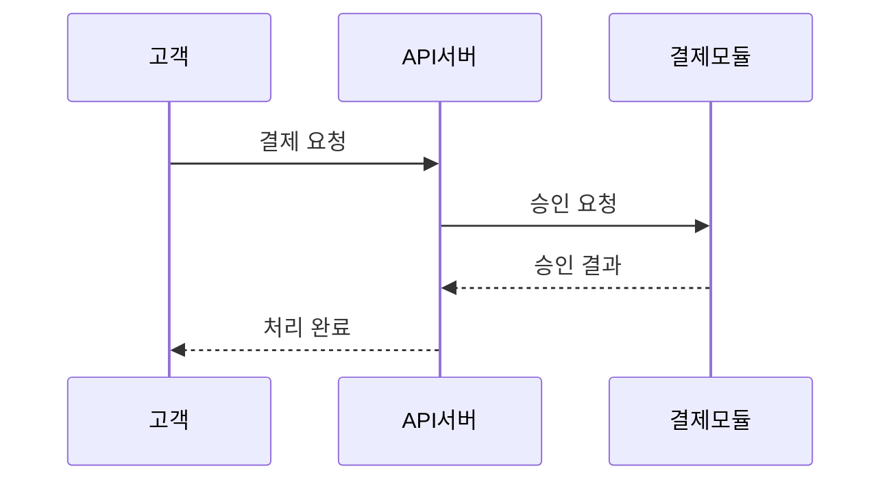

# gendocs 문서 생성 플로우

이 스킬은 대화형으로 문서를 생성하는 가이드 플로우를 실행합니다.
아래 단계를 순서대로 진행하세요. 각 단계에서 AskUserQuestion으로 사용자 선택을 받습니다.

$ARGUMENTS 가 있으면:
- `.md` 파일이면 해당 파일을 원본으로 사용하고 2단계를 건너뛰세요.
- 다른 파일 확장자(`.docx`, `.pdf`, `.txt`, `.xlsx`, `.hwp` 등)면 2단계의 "기존 파일 변환"으로 진행하세요.
- 파일 경로가 아닌 텍스트면 문서 주제 설명으로 간주하고 2단계의 "구두 설명"으로 진행하세요.

---

## 1단계: 출력 포맷 선택

AskUserQuestion으로 물어보세요:

| 선택지 | 설명 |
|--------|------|
| Word (.docx) | API 명세서, 요건 정의서, 기술 문서 (검증 완료) |
| Excel (.xlsx) | 데이터 명세, 코드 정의서, 모니터링 대시보드 (검증 완료) |
| PowerPoint (.pptx) | 제안서, 발표 자료 (예정) |
| PDF (.pdf) | 최종 배포용 (예정) |

> 현재 Word(.docx)과 Excel(.xlsx)이 검증 완료 상태입니다. 다른 포맷 선택 시 "아직 지원되지 않는 포맷입니다. DOCX를 먼저 생성하시겠습니까?" 로 안내하세요.
> Excel 선택 시 아래 **XLSX AI 분석 가이드** 섹션을 참조하세요.

---

## 2단계: 소스 입력

**AskUserQuestion으로 물어보세요: "어떤 소스를 가지고 계신가요?"**

| 선택지 | 설명 |
|--------|------|
| 기존 파일 변환 | 가지고 있는 파일(Word, PDF, 텍스트, 엑셀 등)을 깔끔한 문서로 재작성 |
| 텍스트 붙여넣기 | 대화창에 내용을 직접 붙여넣기 |
| 구두 설명 | 만들고 싶은 문서를 설명하면 Claude Code가 작성 |
| source/ 폴더의 MD 파일 | 이미 준비된 마크다운 파일 사용 |

각 선택지별 처리:

### A. 기존 파일 변환

1. 사용자에게 파일 경로를 물어보세요.
2. 파일 포맷에 따라 내용을 추출하세요:
   - `.docx` → `python -X utf8 tools/extract-docx.py <파일> --json [--extract-images <dir>]` 실행 (ZIP+XML 방식, 의존성 없음). 제목/테이블/코드블록/인포박스/이미지를 구조화된 JSON으로 추출합니다. 이미지가 있으면 `--extract-images`로 함께 추출합니다.
   - `.pdf` → 아래 **PDF 자동 파싱** 절차를 따르세요. (수동 Read 불필요)
   - `.txt` / `.csv` / `.json` / `.yaml` → Read 도구로 텍스트 직접 읽기.
   - `.xlsx` → Read 도구로 읽기 (시트 내용 추출).
   - `.hwp` → 읽기 불가 시 사용자에게 텍스트로 붙여넣기를 안내하세요.
3. 추출된 내용을 분석하여 **문서 구조를 파악**하세요:
   - 제목 계층 (heading level)
   - 테이블 헤더 패턴 (doc-config tableWidths에 활용)
   - 코드블록 (dark/light), 인포박스, 경고박스
4. gendocs 마크다운 규칙에 맞춰 `source/` 에 MD 파일을 자동 생성하세요.
5. 생성된 MD를 사용자에게 간략히 보고: "N개 섹션, M개 테이블로 구성된 MD를 생성했습니다."
6. **원본 소스 카운트를 기록**하세요 (섹션 수, 테이블 수, 코드블록 수, 이미지 수 등). 5단계 콘텐츠 검증에서 사용합니다.
7. 3단계로 진행.

#### PDF 자동 파싱

PDF는 `extract-pdf-ir.py`로 자동 파싱합니다. 2단계 파이프라인:

**Step 1: 메타데이터 추출 + 구조 분류**
```bash
python -X utf8 tools/extract-pdf-ir.py <파일.pdf> --meta-only
```
출력된 JSON을 읽고, 직접 판단하세요:
- `fontDistribution`: 가장 많은 문자 수 = 본문. 그보다 큰 크기들을 H2~H5에 매핑
- `firstPages`: 0페이지가 표지인지, 1페이지가 목차인지 판단
- 결과를 `{ "levelMap": {"22": 2, "18": 3}, "coverPages": [0], "tocPages": [1] }` 형태로 결정

**Step 2: 분류 결과로 변환**
```bash
python -X utf8 tools/extract-pdf-ir.py <파일.pdf> --json --classify "<JSON>"
```
이 출력이 SemanticIR이며, 이후 MD 생성 없이 바로 doc-config → `node lib/convert.js`로 변환 가능.

**classify 없이 직접 변환도 가능** (휴리스틱 fallback):
```bash
node lib/convert.js doc-configs/문서.json
```
단, 섹션 번호가 없는 PDF에서는 heading 레벨이 부정확할 수 있으므로 Step 1~2 권장.

**규칙 기반으로 정확한 것** (분류 불필요):
- 섹션 번호 (`4.1.2` 등) → 번호 깊이로 heading 레벨 자동 결정
- `flags & 8` → 모노스페이스(코드블록) 자동 감지
- 중괄호 추적 → JSON 코드블록 자동 감지
- 불릿 패턴 (`-`, `•` 등) → listItem 자동 감지
- 동일 헤더 테이블 → cross-page 자동 병합

### B. 텍스트 붙여넣기

1. 사용자에게 내용을 붙여넣어 달라고 안내하세요.
2. 붙여넣어진 텍스트를 분석하여 구조화하세요:
   - 줄바꿈, 들여쓰기, 구분자 패턴으로 섹션 분리
   - 탭/콤마 구분 데이터는 테이블로 변환
   - 코드 패턴 감지 시 코드블록으로 감싸기
3. gendocs MD 형식으로 `source/` 에 저장.
4. 셀프리뷰 단계로 진행.

### C. 구두 설명

1. 사용자에게 물어보세요:
   - "어떤 종류의 문서인가요?" (API 명세서, 요건 정의서, 제안서, 가이드 등)
   - "어떤 내용을 포함해야 하나요?" (섹션, 주요 항목)
   - "특별히 포함할 데이터가 있나요?" (테이블, 코드 예시 등)
2. 사용자 답변을 기반으로 MD를 작성하여 `source/`에 저장.
3. 셀프리뷰 단계로 진행.

### D. source/ 폴더의 MD 파일

1. source/ 폴더를 조회하여 기존 MD 파일 목록을 AskUserQuestion으로 보여주세요.
2. 사용자가 파일을 선택하면 셀프리뷰 단계로 진행.

---

### MD 생성 규칙

기존 파일 변환, 텍스트 붙여넣기, 구두 설명 모두 최종적으로 MD를 생성합니다.
생성되는 MD는 다음 구조를 따르세요:

```markdown
# 문서 제목

> **프로젝트**: ...
> **버전**: v1.0
> **작성일**: YYYY-MM-DD

---

## 목차

- [변경 이력](#변경-이력)
- [1. 섹션명](#1-섹션명)
- ...

---

## 변경 이력

| 버전 | 날짜 | 작성자 | 변경 내용 |
|------|------|--------|-----------|
| v1.0 | YYYY-MM-DD | 작성자 | 초안 작성 |

> **변경 이력 작성 규칙**: v1.0 이전 버전(v0.8, v0.9 등)이 존재하면 v1.0의 변경 내용은 "초안 작성"이 아닌 "정식 릴리스" 또는 "전체 문서 통합"으로 표기하세요. "초안 작성"은 변경 이력이 1건뿐일 때만 사용합니다.

---

## 1. 섹션명

### 1.1 소제목

본문 내용...

| 헤더1 | 헤더2 | 헤더3 |
|-------|-------|-------|
| 값1 | 값2 | 값3 |
```

핵심 규칙:
- H1은 문서 제목 (1개만)
- H2는 대분류 섹션 (`## 변경 이력`, `## 1. 개요`, ...)
- H3는 소분류 (`### 1.1 목적`)
- 테이블은 마크다운 표준 문법
- 인용문: `> 주의:` → 경고 박스, `> 참고:` / `> 중요:` → 정보 박스
- 코드블록: ` ```언어 ` 형식
- 이미지: ``
- 흐름도: `**Step 1**: 설명` 형식

### 다이어그램 자동 삽입 규칙

MD를 생성할 때, 아래 유형의 내용이 있으면 **다이어그램 코드블록을 자동으로 포함**하세요. 텍스트로만 설명하는 것보다 시각 자료가 문서 품질을 크게 높입니다.

**삽입 판단 기준** — 다음 중 하나에 해당하면 다이어그램을 넣으세요:

| 문서 내용 | 다이어그램 유형 | 렌더러 |
|-----------|----------------|--------|
| API 호출 흐름, 시스템 간 통신 | `sequenceDiagram` | Mermaid |
| 처리 절차, 분기 로직, 의사결정 | `flowchart` | Mermaid |
| 상태 변화 (주문 상태, 승인 흐름 등) | `stateDiagram-v2` | Mermaid |
| 데이터 모델, 테이블 관계 | `erDiagram` | Mermaid |
| 일정, 마일스톤 | `gantt` | Mermaid |
| 클래스 구조, 모듈 관계 | `classDiagram` | Mermaid |
| 시스템 아키텍처, 계층 구조 | `digraph` | Graphviz (dot) |
| 네트워크 토폴로지, 인프라 구성 | `digraph` / `graph` | Graphviz (dot) |
| 모듈/패키지 의존성 | `digraph` | Graphviz (dot) |

**작성 형식** — 반드시 `<!-- diagram: 설명 -->` 주석을 코드블록 바로 위에 추가하세요. 이 주석이 없으면 일반 코드블록으로 취급되어 렌더링되지 않습니다:

```markdown
### 1.1 결제 처리 흐름

아래는 결제 요청부터 완료까지의 처리 흐름입니다.

<!-- diagram: 결제 처리 시퀀스 -->

```

**삽입하지 않는 경우**:
- 단순 설정 목록, 파라미터 표 등 시각화 가치가 없는 경우
- 이미 사용자가 제공한 이미지(``)가 해당 내용을 충분히 설명하는 경우
- 다이어그램으로 표현하기에 데이터가 부족한 경우 (노드 2개 이하)

**프로젝트 소스 분석 시 다이어그램 소재 찾기**:

프로젝트 코드를 분석하여 문서를 생성하는 경우, 다음을 적극적으로 탐색하세요:
- 컨트롤러/라우터 → API 호출 흐름 (sequenceDiagram)
- DB 모델/엔티티 → ERD (erDiagram)
- 상태 enum/상수 → 상태 다이어그램 (stateDiagram-v2)
- 디렉토리 구조/모듈 import → 아키텍처/의존성 (Graphviz digraph)
- 미들웨어 체인/파이프라인 → 처리 흐름 (flowchart)
- 설정 파일(docker-compose, k8s 등) → 인프라 구성 (Graphviz digraph)

---

## 셀프리뷰 (필수 게이트 — 생략 금지)

**MD를 생성하거나 선택한 후, 이 단계를 완료하기 전에 3단계로 진행하지 마세요.**

2단계에서 MD가 준비되면(생성, 변환, 선택 모두 해당), 반드시 아래 셀프리뷰를 수행합니다:

1. **MD 구조 린트 (자동)**

   ```bash
   python -X utf8 tools/lint-md.py source/{파일}.md --json
   ```

   lint-md.py가 11가지 구조 검사를 수행합니다:
   - **metadata** — 메타데이터 블록쿼트(프로젝트/버전/작성일) 완성도
   - **separator** — H2 섹션 사이 `---` 구분선 존재
   - **changeHistory** — v1.0 변경 내용이 "초안 작성"인지
   - **codeBlockBalance** — 코드블록 열림/닫힘 균형 (CRITICAL)
   - **tocConsistency** — 목차 항목과 실제 H2 섹션 일치
   - **htmlArtifact** — 코드블록 외부 HTML 태그 잔여물
   - **nestedBullet** — 중첩 불릿 감지 (CRITICAL, converter가 들여쓰기 무시)
   - **tableColumnCount** — 8개 이상 컬럼 테이블 (WARN)
   - **imageReference** — 이미지 파일 참조 존재 여부 (CRITICAL)
   - **codeLanguageTag** — 코드블록 언어 태그 유효성 (MINOR)
   - **sectionBalance** — H2 섹션 간 분량 불균형 (INFO)

   결과 처리:
   - **CRITICAL** (닫히지 않은 코드블록) → **즉시 수정** (변환하면 이후 콘텐츠 전부 깨짐)
   - **MINOR/STYLE** → source MD 직접 편집으로 수정
   - 배치 모드: `python -X utf8 tools/lint-md.py source/*.md --json`

2. **읽는 사람 관점으로 MD를 처음부터 끝까지 읽기**
   - 섹션 구조가 논리적인가? (목차 → 변경 이력 → 본문 순서)
   - 각 요소의 표현 방식이 적절한가?
     - 소규모 키-값(1~3행 2컬럼)은 테이블 대신 불릿이 자연스러운지
     - 긴 설명문은 테이블 안에 억지로 넣지 않았는지
     - 코드블록의 언어 태그가 올바른지
   - 누락된 섹션이나 불완전한 내용이 없는지

3. **어색한 부분 수정** → source/ MD 파일 직접 편집

4. **반복 패턴 여부 판단**
   - 발견한 문제가 이 문서만의 문제가 아니라 반복될 패턴이면, 원인이 된 규칙(SKILL.md, MEMORY.md 등)도 함께 수정
   - 규칙 수정 시: `npm test`를 실행하여 핵심 함수가 깨지지 않는지 확인

5. **배치(batch) 처리 시에도 예외 없음**
   - 여러 문서를 한 번에 처리하더라도, 각 MD에 대해 셀프리뷰를 수행
   - 시간 제약 시 최소한 샘플 3~5개를 대표로 검토
   - 린트(1번)는 전수 실행, AI 리뷰(2번)는 샘플 허용

> 셀프리뷰 완료 후 3단계로 진행합니다.

---

## 3단계: 템플릿 선택

AskUserQuestion으로 물어보세요:

| 선택지 | 설명 |
|--------|------|
| Professional (권장) | 가로 레이아웃, 다크테마 코드블록, 표지, 머릿글/바닥글 |
| Basic | 세로 레이아웃, 심플 스타일 |

---

## 3.5단계: 테마 선택

AskUserQuestion으로 물어보세요: "문서 테마를 선택하세요"

| 선택지 | 설명 |
|--------|------|
| Navy Professional (기본) | 네이비 헤더, 골드 강조 — 기존 스타일과 동일 |
| Slate Modern | 쿨그레이, 모던한 느낌 |
| Teal Corporate | 티얼/그린, 기업 문서용 |
| Wine Elegant | 와인/버건디, 포멀한 느낌 |
| Blue Standard | 블루 기본, 심플 |

> "기본값으로" 또는 선택하지 않으면 Navy Professional이 적용됩니다.

doc-config에 `"theme"` 필드를 포함하세요:
- Navy Professional → `"theme"` 생략 (기본값)
- Slate Modern → `"theme": "slate-modern"`
- Teal Corporate → `"theme": "teal-corporate"`
- Wine Elegant → `"theme": "wine-elegant"`
- Blue Standard → `"theme": "blue-standard"`

특정 색상만 오버라이드하려면 `"style"` 필드를 추가:
```json
{
  "theme": "teal-corporate",
  "style": { "colors": { "accent": "FF6B35" } }
}
```

---

## 4단계: 문서 정보 입력

AskUserQuestion으로 물어보세요:

- **문서 제목**: 기본값은 MD 파일의 H1 제목
- **부제목**: 선택사항
- **버전**: 기본값 v1.0
- **작성자/회사**: 선택사항

> 사용자가 "기본값으로" 또는 "그냥 진행해"라고 하면 MD에서 추출한 기본값으로 진행하세요.

---

## 자가개선 3계층

문서 생성 과정에서 3단계의 자가개선이 동작합니다.

| 계층 | 시점 | 무엇을 | 어떻게 |
|------|------|--------|--------|
| ① MD 셀프리뷰 | 변환 전 | MD 구조 + 표현 적절성 | lint-md.py 자동 검사 → AI 읽기 리뷰 → 수정 |
| ② AI 셀프리뷰 | 변환 후 | 콘텐츠 정합성 + 품질 | review-docx.py 자동 분석 + AI 판단 |
| ③ 레이아웃 루프 | 변환 후 | 페이지 배치 | `--pipeline`이 자동 실행 (fix-rules + 재변환, 최대 4회) |
| ④ 경험 기억 | 세션 간 | 교정 경험 재활용 | reflections.json 자동 기록 (pipeline이 reflections-writer 호출) |

- 계층 ①: 2단계 후 **필수 게이트** → [셀프리뷰](#셀프리뷰-필수-게이트--생략-금지)
- 계층 ②: 5단계 변환 후 실행 → [5-4. AI 셀프리뷰](#5-4-계층--ai-셀프리뷰-콘텐츠--품질)
- 계층 ③④: `--pipeline` 플래그가 자동 처리 → [6단계](#6단계-자가개선-루프-pipelinejs-자동-처리)

---

## 5단계: doc-config 생성 + 변환 실행

이 단계는 자동으로 진행합니다. 사용자에게 진행 상황을 알려주세요.

### 5-1. doc-config JSON 작성

기존 doc-configs/ 에서 유사한 설정 파일을 참조하여 `doc-configs/{파일명}.json`을 작성하세요.

**참조할 것** (우선순위 순):

1. **경험 기억 (Reflexion)**: `lib/reflections.json`이 있으면 현재 문서와 유사한 경험 조회:
   - 동일 `docType` 항목 필터링
   - `outcome`이 "FIX"/"SUGGEST_APPLIED" → `reflection`과 `fix` 참조하여 doc-config에 사전 반영
   - `outcome`이 "ROLLBACK" → **하지 말아야 할 것**으로 참조
   - 매칭: 동일 docType > 동일 tags > 동일 issue.type
   - 예: 과거 api-spec에서 `imageH3AlwaysBreak: true`가 FIX 기록 → 새 API 문서에 기본 포함
   - 예: 과거 batch-spec에서 H4 일괄 break ROLLBACK 기록 → 같은 시도 금지
   > reflections.json이 없거나 빈 배열이면 이 단계 건너뛰기

2. **기존 doc-configs**: `examples/sample-api/doc-config.json`, `examples/sample-batch/doc-config.json`
3. **패턴 DB**: `lib/patterns.json` (자동 fallback — converter-core.js가 처리)
4. **변환 로직**: `lib/converter-core.js` — config JSON 스키마

doc-config JSON에 포함할 내용:
```json
{
  "source": "source/파일명.md",
  "output": "output/파일명_{version}.docx",
  "template": "professional",
  "theme": "navy-professional",
  "_meta": { "createdBy": "ai", "createdAt": "YYYY-MM-DD" },
  "h1CleanPattern": "^# 문서제목패턴",
  "headerCleanUntil": "## 변경 이력",
  "docInfo": { "title": "...", "subtitle": "...", "version": "v1.0", ... },
  "tableWidths": { "헤더1|헤더2|헤더3": [w1, w2, w3], ... },
  "pageBreaks": { ... },
  "images": { "basePath": "...", "sectionMap": { ... } },
  "diagrams": { "enabled": true },
  "style": { "colors": { "accent": "FF6B35" } }
}
```

> **다이어그램 설정**: source MD에 `<!-- diagram: -->` 주석이 포함된 코드블록이 있으면 `"diagrams": { "enabled": true }`를 반드시 포함하세요. 다이어그램이 없으면 이 필드를 생략해도 됩니다.

> `_meta.createdBy`: `/gendocs` 스킬로 생성 시 `"ai"`, 사용자가 수작업으로 작성 시 `"human"`. 패턴 붕괴 방지를 위한 출처 추적에 사용.

### 5-2. 실행 (자가개선 파이프라인)

```bash
node lib/convert.js doc-configs/{파일명}.json --pipeline
```

`--pipeline`은 변환→검증→자동수정을 최대 4회 반복합니다.
- WARN 0 → PASS (즉시 완료)
- suggestion 있는 WARN → doc-config 자동 수정 → 재변환
- suggestion 없는 WARN → NEEDS_MANUAL (수동 수정 필요)
- 조기 종료: STOP_PLATEAU (WARN 수 정체), STOP_OSCILLATION (WARN 수 진동)

파이프라인 없이 단순 변환만 하려면:
```bash
node lib/convert.js doc-configs/{파일명}.json --validate
```

### 5-4. 계층 ② — AI 셀프리뷰 (콘텐츠 + 품질)

**Part A: 자동 리뷰 (review-docx.py)**

```bash
python -X utf8 tools/review-docx.py output/{파일}.docx --config doc-configs/{파일}.json --json
```

스크립트가 6가지 검사를 수행합니다:
1. **콘텐츠 정합성** — 소스 MD vs DOCX 요소 수 비교 (H2/H3/H4, 테이블, 코드블록, 이미지, 불릿, 인포/경고박스)
2. **컬럼 너비 불균형** — 한 컬럼이 줄바꿈되는데 인접 컬럼은 빈 공간이 많은 경우 감지 + 너비 재분배 제안
3. **테이블 가독성** — 8개 이상 컬럼, 빈 컬럼, 셀 오버플로우
4. **코드블록 무결성** — 잘린 JSON, 빈 코드블록
5. **페이지 분포** — 희소 페이지, 연속 희소 페이지
6. **제목 구조** — 동일 연속 제목, H3 없는 긴 H2 섹션

결과 처리:
- **WARN** (콘텐츠 누락, 잘린 코드 등) → 즉시 수정 (source MD 또는 doc-config)
- **SUGGEST** (너비 재분배) → 명확한 개선이면 적용 (doc-config tableWidths 업데이트 → 재변환)
  - SUGGEST를 적용한 경우 `lib/reflections.json`에 기록: `layer`: 2, `outcome`: "SUGGEST_APPLIED", `fix`: 적용한 너비 변경 내용
- **INFO** (많은 컬럼, 희소 페이지 등) → 5-5 리포트에 포함

**Part B: AI 판단 리뷰**

review-docx.py 결과를 검토한 후, `extract-docx.py --json` 출력을 읽고 추가 판단:
1. 테이블 데이터가 문맥상 맞는가?
2. 인포/경고 박스가 적절한 위치인가?
3. 문서 전체 흐름이 논리적인가?
4. 구조적으로 "이상해 보이는" 부분이 있는가?

> Part B는 WARN/SUGGEST가 0건일 때도 반드시 수행합니다.

### 5-5. 결과 리포트
검증 결과를 사용자에게 보고하세요:
- 추정 페이지 수
- WARN/INFO 건수
- 주요 이슈 내용
- 콘텐츠 검증 결과 (원본 대비 일치 여부)

### 5-6. 품질 점수 (선택)

변환+검증 완료 후 품질 점수를 산출합니다:
```bash
node tools/score-docx.js doc-configs/{파일명}.json --skip-convert
```
사용자에게 5차원 점수와 총점을 보고하세요.

---

## 6단계: 자가개선 루프 (pipeline.js 자동 처리)

5-2에서 `--pipeline`을 사용했으면 자가개선 루프가 이미 실행됨. 결과를 해석하세요.

### pipeline 결과 해석

| status | 의미 | 행동 |
|--------|------|------|
| **PASS** | WARN 0건 | 완료 |
| **FIX** | 자동 수정 후 WARN 해소 | 수정 내용 보고 후 완료 |
| **NEEDS_MANUAL** | 자동 수정 불가 WARN 남음 | Claude Code가 doc-config/source MD 수동 수정 후 재실행 |
| **STOP_PLATEAU** | WARN 수 2회 동일 | 현재 결과 사용, 사용자에게 보고 |
| **STOP_OSCILLATION** | WARN 수 진동 | 현재 결과 사용, 사용자에게 보고 |
| **ROLLBACK** | 페이지 수 10%↑ | 이전 결과 복원 |

### NEEDS_MANUAL 시 수동 개입

pipeline이 NEEDS_MANUAL로 중단되면:
1. 남은 WARN 목록을 분석
2. doc-config (`pageBreaks`, `tableWidths`) 또는 source MD를 수정
3. 재실행: `node lib/convert.js doc-configs/{파일명}.json --pipeline`

> NARROW_IMAGE/FLAT_IMAGE WARN은 source MD의 다이어그램 코드블록 수정이 필요합니다 (doc-config만으로 해결 불가). 선형 체인(8개+ 노드)은 Graphviz DOT `rankdir=TB` + `rank=same`으로 전환하세요.

### 루프 종료 후 사용자 선택 (WARN이 남아있을 때)

STOP_PLATEAU/STOP_OSCILLATION으로 종료되었고 WARN이 남아있으면:

| 선택지 | 설명 |
|--------|------|
| 이대로 완료 | 현재 결과를 최종 확정 |
| 직접 피드백 | 사용자가 추가 수정사항 지시 → 5단계 재진행 |

---

## 완료

최종 산출물 경로를 안내하세요:
```
output/{파일명}.docx 생성 완료
```

변환이 성공(WARN 0)하면 패턴 DB를 갱신하고 점수를 기록하세요:
```bash
node tools/extract-patterns.js
node tools/score-docx.js doc-configs/{파일명}.json --skip-convert --save
```

패턴 다양성 감사 (선택):
```bash
node tools/extract-patterns.js --audit    # 출처 분포 + 다양성 메트릭 리포트
```

> reflections.json 기록은 `--pipeline`이 자동 처리합니다.

재실행 방법도 알려주세요:
```
재실행:     node lib/convert.js doc-configs/{파일명}.json
검증:       node lib/convert.js doc-configs/{파일명}.json --validate
자가개선:   node lib/convert.js doc-configs/{파일명}.json --pipeline
재검증: python -X utf8 tools/validate-docx.py output/{파일명}.docx
테스트: npm test
```

---

## 진단 모드 (선택)

문서 생성 후 전체 파이프라인 상태를 한눈에 확인하고 싶을 때 사용합니다.

```bash
node tools/pipeline-audit.js doc-configs/{파일명}.json              # 단일 진단
node tools/pipeline-audit.js doc-configs/{파일명}.json --json       # JSON 출력
node tools/pipeline-audit.js doc-configs/{파일명}.json --skip-convert  # 기존 DOCX
node tools/pipeline-audit.js --batch --skip-convert                 # 전체 진단
```

**사용 시점**:
- 생성 완료 후 전체 품질 상태를 확인할 때
- 배치 생성 후 문제 문서를 빠르게 식별할 때
- 이슈의 근본 원인(source MD / doc-config / converter)을 추적할 때

**Health 판정**:

| 판정 | 조건 | 설명 |
|------|------|------|
| EXCELLENT | 점수 9.5+, WARN 0 | 최적 상태 |
| GOOD | 점수 8.0+, WARN ≤ 2 | 양호 |
| NEEDS_FIX | 점수 < 8.0 또는 WARN > 2 | 수정 필요 |
| BROKEN | lint CRITICAL 또는 변환 실패 | 소스 수정 필수 |

**근본 원인 4계층**:

| 계층 | 의미 | 수정 대상 |
|------|------|-----------|
| source | MD 원본 문제 | source/ MD 파일 |
| config | 변환 설정 문제 | doc-configs/ JSON |
| converter | 변환 엔진 버그 | lib/converter-core.js |
| info | 참고용 (수정 불필요) | 시뮬레이션 추정치 |

---

## XLSX AI 분석 가이드

Excel 문서 생성 시, AI가 MD를 분석하여 최적의 doc-config를 설계합니다.

### XLSX 분석 체크리스트

MD를 받으면 다음 6가지를 판단하세요:

1. **데이터 유형 분석** — 이 MD에 어떤 종류의 데이터가 있는가?
   - 코드 정의 (코드|코드명|설명) → 단순 테이블
   - KPI/지표 (수치 요약 + 상세 데이터) → 대시보드 + 테이블
   - 로그/이력 (날짜별 기록) → 시계열 테이블
   - 비교/분석 (항목별 점수/비율) → 요약 + 상세

2. **시트 분배** — 어떤 테이블을 어떤 시트에 넣을지
   - H2 섹션별 분할이 자연스러운가? → `sheetMapping: "h2"` (기본)
   - 특정 조합이 필요한가? → `xlsx.sheets[]` 커스텀
   - 대시보드 + 상세 시트가 필요한가? → `xlsx.sheets[]` + `layout: "dashboard"`

3. **컬럼 타입** — 각 컬럼이 어떤 데이터인지
   - 숫자 (호출 수, 건수) → `type: "number"` → 우정렬 + #,##0 서식
   - 퍼센트 (성공률, 비율) → `type: "percentage"` → 0.0% 서식
   - 날짜 (작성일, 발생일) → `type: "date"` → YYYY-MM-DD
   - 상태 (성공/실패/대기) → `type: "status"` → 의미론적 색상
   - 코드 (API 경로, 코드값) → `type: "code"` → Consolas 폰트

4. **레이아웃 선택**
   - `data-table` — 단순 데이터 테이블 (기본)
   - `dashboard` — KPI 카드 + 요약 테이블
   - `summary-detail` — 상위 요약 + 하단 상세

5. **수식 필요 여부** — 합계, 평균, 비율 계산
   - 숫자 컬럼 → `summary: "sum"` / `"average"` / `"count"` / `"min"` / `"max"`
   - 비율 계산 → `formula: "{발생 건수}/{합계}"` (컬럼명 참조)
   - `summaryRow: true` → 테이블 하단에 합계 행 자동 생성

6. **시각적 강조** — 의미론적 색상
   - `xlsx.semanticColors: true` → 전역 활성화
   - `type: "status"` 컬럼은 자동으로 색상 적용
   - 기본 매핑: 성공→초록, 실패→빨강, 경고→주황, 진행 중→파랑

### doc-config 패턴별 예시

**패턴 1: 단순 코드 정의서** (기존 sheetMapping)
```json
{
  "format": "xlsx",
  "template": "data-spec",
  "xlsx": {
    "sheetMapping": "h2",
    "coverSheet": true,
    "freezeHeaders": true,
    "autoFilter": true
  },
  "tableWidths": {
    "코드|코드명|설명": [12, 20, 45]
  }
}
```

**패턴 2: 대시보드 + 상세 데이터** (커스텀 sheets[])
```json
{
  "format": "xlsx",
  "template": "data-spec",
  "xlsx": {
    "sheetMapping": "custom",
    "semanticColors": true,
    "sheets": [
      {
        "name": "📊 대시보드",
        "source": "## 현황 요약",
        "sections": [
          {
            "type": "kpi-cards",
            "cards": [
              { "title": "총 건수", "valueFrom": "총 건수|값", "color": "primary" },
              { "title": "성공률", "valueFrom": "성공률|값", "color": "accent" }
            ]
          },
          {
            "type": "table",
            "source": "### 항목별 현황",
            "columnDefs": {
              "건수": { "type": "number", "summary": "sum" },
              "비율": { "type": "percentage", "summary": "average" },
              "상태": { "type": "status" }
            },
            "summaryRow": true
          }
        ]
      },
      {
        "name": "📋 상세 데이터",
        "source": "## 상세 로그",
        "columnDefs": {
          "날짜": { "type": "date" },
          "건수": { "type": "number" }
        }
      }
    ]
  }
}
```

**패턴 3: 세로 인쇄 + 의미론적 색상**
```json
{
  "format": "xlsx",
  "xlsx": {
    "sheetMapping": "h2",
    "orientation": "portrait",
    "semanticColors": true
  }
}
```

### 하위 호환

- `xlsx.sheets[]` 없으면 → 기존 `sheetMapping` 그대로 동작
- `columnDefs` 없으면 → 전부 text로 처리 (기존 동작)
- `semanticColors` 없으면 → false (기존 동작)
- 기존 doc-config 수정 불필요
