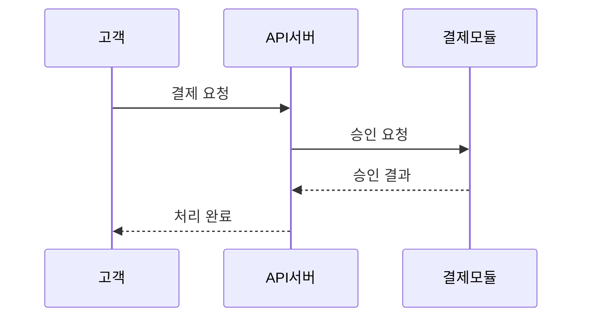
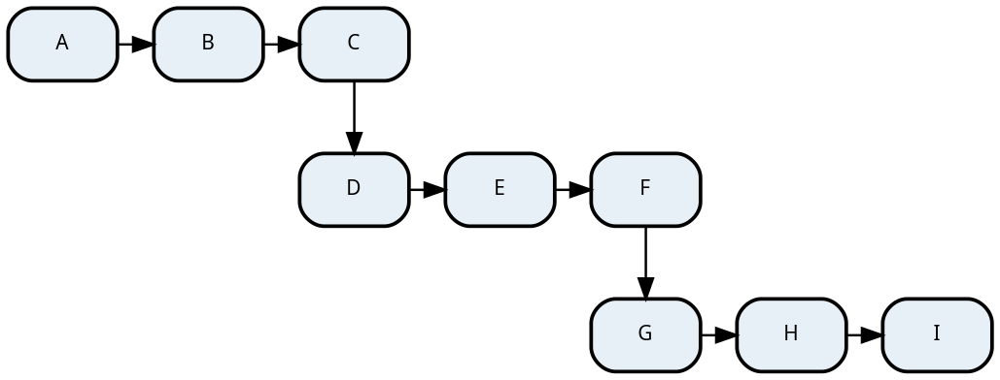

# gendocs 문서 생성 플로우

이 스킬은 대화형으로 문서를 생성하는 가이드 플로우를 실행합니다.
아래 단계를 순서대로 진행하세요. 각 단계에서 AskUserQuestion으로 사용자 선택을 받습니다.

$ARGUMENTS 가 있으면:
- `.md` 파일이면 해당 파일을 원본으로 사용하고 2단계를 건너뛰세요.
- 다른 파일 확장자(`.docx`, `.pdf`, `.txt`, `.xlsx`, `.hwp` 등)면 2단계의 "기존 파일 변환"으로 진행하세요.
- 파일 경로가 아닌 텍스트면 문서 주제 설명으로 간주하고 2단계의 "구두 설명"으로 진행하세요.

---

## 1단계: 출력 포맷 선택

AskUserQuestion으로 물어보세요:

| 선택지 | 설명 |
|--------|------|
| Word (.docx) | API 명세서, 요건 정의서, 기술 문서 (검증 완료) |
| Excel (.xlsx) | 데이터 명세, 코드 정의서 (예정) |
| PowerPoint (.pptx) | 제안서, 발표 자료 (예정) |
| PDF (.pdf) | 최종 배포용 (예정) |

> 현재 Word(.docx)만 검증 완료 상태입니다. 다른 포맷 선택 시 "아직 지원되지 않는 포맷입니다. DOCX를 먼저 생성하시겠습니까?" 로 안내하세요.

---

## 2단계: 소스 입력

**AskUserQuestion으로 물어보세요: "어떤 소스를 가지고 계신가요?"**

| 선택지 | 설명 |
|--------|------|
| 기존 파일 변환 | 가지고 있는 파일(Word, PDF, 텍스트, 엑셀 등)을 깔끔한 문서로 재작성 |
| 텍스트 붙여넣기 | 대화창에 내용을 직접 붙여넣기 |
| 구두 설명 | 만들고 싶은 문서를 설명하면 Claude Code가 작성 |
| source/ 폴더의 MD 파일 | 이미 준비된 마크다운 파일 사용 |

각 선택지별 처리:

### A. 기존 파일 변환

1. 사용자에게 파일 경로를 물어보세요.
2. 파일 포맷에 따라 내용을 추출하세요:
   - `.docx` → `python -X utf8 tools/extract-docx.py <파일> --json [--extract-images <dir>]` 실행 (ZIP+XML 방식, 의존성 없음). 제목/테이블/코드블록/인포박스/이미지를 구조화된 JSON으로 추출합니다. 이미지가 있으면 `--extract-images`로 함께 추출합니다.
   - `.pdf` → Read 도구로 내용 추출. 아래 **PDF 구조화 규칙**을 반드시 따르세요.
   - `.txt` / `.csv` / `.json` / `.yaml` → Read 도구로 텍스트 직접 읽기.
   - `.xlsx` → Read 도구로 읽기 (시트 내용 추출).
   - `.hwp` → 읽기 불가 시 사용자에게 텍스트로 붙여넣기를 안내하세요.
3. 추출된 내용을 분석하여 **문서 구조를 파악**하세요:
   - 제목 계층 (heading level)
   - 테이블 헤더 패턴 (doc-config tableWidths에 활용)
   - 코드블록 (dark/light), 인포박스, 경고박스
4. gendocs 마크다운 규칙에 맞춰 `source/` 에 MD 파일을 자동 생성하세요.
5. 생성된 MD를 사용자에게 간략히 보고: "N개 섹션, M개 테이블로 구성된 MD를 생성했습니다."
6. **원본 소스 카운트를 기록**하세요 (섹션 수, 테이블 수, 코드블록 수, 이미지 수 등). 5단계 콘텐츠 검증에서 사용합니다.
7. 3단계로 진행.

#### PDF 구조화 규칙

PDF는 DOCX와 달리 heading level, 테이블 구조 등의 메타데이터가 없으므로 내용을 추론하여 구조화합니다. **converter가 지원하는 요소만** 사용하세요:

**지원 요소**: H2, H3, H4, 불릿(`-`), 테이블, 코드블록, 인포박스(`> 참고:`), 경고박스(`> 주의:`), 이미지, 본문 텍스트

**금지**: 중첩 불릿 리스트 (converter가 들여쓰기를 무시하므로 구조가 손실됨)

**구조 변환 원칙**:
- 중첩 리스트(3단계 이상, 다차원 구조) → **테이블**로 변환
- 단순 키-값 1~3개 → `- **키** — 값` 형식의 불릿 사용 (소규모 2컬럼 테이블 남용 금지)
- 코드, 명령어, 설정 값은 코드블록(` ``` `)으로 감싸기
- 주의/참고 사항은 인용문(`> 주의:`, `> 참고:`)으로 표현

**heading level 판단**:
- PDF에서 가장 큰 제목 → H2 (H1은 문서 제목 1개만)
- 그 아래 소제목 → H3
- 그 아래 세부 항목 → H4
- 볼드 텍스트가 독립 줄에 있으면 heading 후보

### B. 텍스트 붙여넣기

1. 사용자에게 내용을 붙여넣어 달라고 안내하세요.
2. 붙여넣어진 텍스트를 분석하여 구조화하세요:
   - 줄바꿈, 들여쓰기, 구분자 패턴으로 섹션 분리
   - 탭/콤마 구분 데이터는 테이블로 변환
   - 코드 패턴 감지 시 코드블록으로 감싸기
3. gendocs MD 형식으로 `source/` 에 저장.
4. 셀프리뷰 단계로 진행.

### C. 구두 설명

1. 사용자에게 물어보세요:
   - "어떤 종류의 문서인가요?" (API 명세서, 요건 정의서, 제안서, 가이드 등)
   - "어떤 내용을 포함해야 하나요?" (섹션, 주요 항목)
   - "특별히 포함할 데이터가 있나요?" (테이블, 코드 예시 등)
2. 사용자 답변을 기반으로 MD를 작성하여 `source/`에 저장.
3. 셀프리뷰 단계로 진행.

### D. source/ 폴더의 MD 파일

1. source/ 폴더를 조회하여 기존 MD 파일 목록을 AskUserQuestion으로 보여주세요.
2. 사용자가 파일을 선택하면 셀프리뷰 단계로 진행.

---

### MD 생성 규칙

기존 파일 변환, 텍스트 붙여넣기, 구두 설명 모두 최종적으로 MD를 생성합니다.
생성되는 MD는 다음 구조를 따르세요:

```markdown
# 문서 제목

> **프로젝트**: ...
> **버전**: v1.0
> **작성일**: YYYY-MM-DD

---

## 목차

- [변경 이력](#변경-이력)
- [1. 섹션명](#1-섹션명)
- ...

---

## 변경 이력

| 버전 | 날짜 | 작성자 | 변경 내용 |
|------|------|--------|-----------|
| v1.0 | YYYY-MM-DD | 작성자 | 초안 작성 |

> **변경 이력 작성 규칙**: v1.0 이전 버전(v0.8, v0.9 등)이 존재하면 v1.0의 변경 내용은 "초안 작성"이 아닌 "정식 릴리스" 또는 "전체 문서 통합"으로 표기하세요. "초안 작성"은 변경 이력이 1건뿐일 때만 사용합니다.

---

## 1. 섹션명

### 1.1 소제목

본문 내용...

| 헤더1 | 헤더2 | 헤더3 |
|-------|-------|-------|
| 값1 | 값2 | 값3 |
```

핵심 규칙:
- H1은 문서 제목 (1개만)
- H2는 대분류 섹션 (`## 변경 이력`, `## 1. 개요`, ...)
- H3는 소분류 (`### 1.1 목적`)
- 테이블은 마크다운 표준 문법
- 인용문: `> 주의:` → 경고 박스, `> 참고:` / `> 중요:` → 정보 박스
- 코드블록: ` ```언어 ` 형식
- 이미지: ``
- 흐름도: `**Step 1**: 설명` 형식

### 다이어그램 자동 삽입 규칙

MD를 생성할 때, 아래 유형의 내용이 있으면 **다이어그램 코드블록을 자동으로 포함**하세요. 텍스트로만 설명하는 것보다 시각 자료가 문서 품질을 크게 높입니다.

**삽입 판단 기준** — 다음 중 하나에 해당하면 다이어그램을 넣으세요:

| 문서 내용 | 다이어그램 유형 | 렌더러 |
|-----------|----------------|--------|
| API 호출 흐름, 시스템 간 통신 | `sequenceDiagram` | Mermaid |
| 처리 절차, 분기 로직, 의사결정 | `flowchart` | Mermaid |
| 상태 변화 (주문 상태, 승인 흐름 등) | `stateDiagram-v2` | Mermaid |
| 데이터 모델, 테이블 관계 | `erDiagram` | Mermaid |
| 일정, 마일스톤 | `gantt` | Mermaid |
| 클래스 구조, 모듈 관계 | `classDiagram` | Mermaid |
| 시스템 아키텍처, 계층 구조 | `digraph` | Graphviz (dot) |
| 네트워크 토폴로지, 인프라 구성 | `digraph` / `graph` | Graphviz (dot) |
| 모듈/패키지 의존성 | `digraph` | Graphviz (dot) |

**작성 형식** — 반드시 `<!-- diagram: 설명 -->` 주석을 코드블록 바로 위에 추가하세요. 이 주석이 없으면 일반 코드블록으로 취급되어 렌더링되지 않습니다:

```markdown
### 1.1 결제 처리 흐름

아래는 결제 요청부터 완료까지의 처리 흐름입니다.

<!-- diagram: 결제 처리 시퀀스 -->

```

**삽입하지 않는 경우**:
- 단순 설정 목록, 파라미터 표 등 시각화 가치가 없는 경우
- 이미 사용자가 제공한 이미지(``)가 해당 내용을 충분히 설명하는 경우
- 다이어그램으로 표현하기에 데이터가 부족한 경우 (노드 2개 이하)

**프로젝트 소스 분석 시 다이어그램 소재 찾기**:

프로젝트 코드를 분석하여 문서를 생성하는 경우, 다음을 적극적으로 탐색하세요:
- 컨트롤러/라우터 → API 호출 흐름 (sequenceDiagram)
- DB 모델/엔티티 → ERD (erDiagram)
- 상태 enum/상수 → 상태 다이어그램 (stateDiagram-v2)
- 디렉토리 구조/모듈 import → 아키텍처/의존성 (Graphviz digraph)
- 미들웨어 체인/파이프라인 → 처리 흐름 (flowchart)
- 설정 파일(docker-compose, k8s 등) → 인프라 구성 (Graphviz digraph)

---

## 셀프리뷰 (필수 게이트 — 생략 금지)

**MD를 생성하거나 선택한 후, 이 단계를 완료하기 전에 3단계로 진행하지 마세요.**

2단계에서 MD가 준비되면(생성, 변환, 선택 모두 해당), 반드시 아래 셀프리뷰를 수행합니다:

1. **MD 구조 린트 (자동)**

   ```bash
   python -X utf8 tools/lint-md.py source/{파일}.md --json
   ```

   lint-md.py가 11가지 구조 검사를 수행합니다:
   - **metadata** — 메타데이터 블록쿼트(프로젝트/버전/작성일) 완성도
   - **separator** — H2 섹션 사이 `---` 구분선 존재
   - **changeHistory** — v1.0 변경 내용이 "초안 작성"인지
   - **codeBlockBalance** — 코드블록 열림/닫힘 균형 (CRITICAL)
   - **tocConsistency** — 목차 항목과 실제 H2 섹션 일치
   - **htmlArtifact** — 코드블록 외부 HTML 태그 잔여물
   - **nestedBullet** — 중첩 불릿 감지 (CRITICAL, converter가 들여쓰기 무시)
   - **tableColumnCount** — 8개 이상 컬럼 테이블 (WARN)
   - **imageReference** — 이미지 파일 참조 존재 여부 (CRITICAL)
   - **codeLanguageTag** — 코드블록 언어 태그 유효성 (MINOR)
   - **sectionBalance** — H2 섹션 간 분량 불균형 (INFO)

   결과 처리:
   - **CRITICAL** (닫히지 않은 코드블록) → **즉시 수정** (변환하면 이후 콘텐츠 전부 깨짐)
   - **MINOR/STYLE** → source MD 직접 편집으로 수정
   - 배치 모드: `python -X utf8 tools/lint-md.py source/*.md --json`

2. **읽는 사람 관점으로 MD를 처음부터 끝까지 읽기**
   - 섹션 구조가 논리적인가? (목차 → 변경 이력 → 본문 순서)
   - 각 요소의 표현 방식이 적절한가?
     - 소규모 키-값(1~3행 2컬럼)은 테이블 대신 불릿이 자연스러운지
     - 긴 설명문은 테이블 안에 억지로 넣지 않았는지
     - 코드블록의 언어 태그가 올바른지
   - 누락된 섹션이나 불완전한 내용이 없는지

3. **어색한 부분 수정** → source/ MD 파일 직접 편집

4. **반복 패턴 여부 판단**
   - 발견한 문제가 이 문서만의 문제가 아니라 반복될 패턴이면, 원인이 된 규칙(SKILL.md, MEMORY.md 등)도 함께 수정
   - 규칙 수정 시: `node tools/regression-test.js`를 실행하여 기존 문서가 깨지지 않는지 확인

5. **배치(batch) 처리 시에도 예외 없음**
   - 여러 문서를 한 번에 처리하더라도, 각 MD에 대해 셀프리뷰를 수행
   - 시간 제약 시 최소한 샘플 3~5개를 대표로 검토
   - 린트(1번)는 전수 실행, AI 리뷰(2번)는 샘플 허용

> 셀프리뷰 완료 후 3단계로 진행합니다.

---

## 3단계: 템플릿 선택

AskUserQuestion으로 물어보세요:

| 선택지 | 설명 |
|--------|------|
| Professional (권장) | 가로 레이아웃, 다크테마 코드블록, 표지, 머릿글/바닥글 |
| Basic | 세로 레이아웃, 심플 스타일 |

---

## 3.5단계: 테마 선택

AskUserQuestion으로 물어보세요: "문서 테마를 선택하세요"

| 선택지 | 설명 |
|--------|------|
| Navy Professional (기본) | 네이비 헤더, 골드 강조 — 기존 스타일과 동일 |
| Slate Modern | 쿨그레이, 모던한 느낌 |
| Teal Corporate | 티얼/그린, 기업 문서용 |
| Wine Elegant | 와인/버건디, 포멀한 느낌 |
| Blue Standard | 블루 기본, 심플 |

> "기본값으로" 또는 선택하지 않으면 Navy Professional이 적용됩니다.

doc-config에 `"theme"` 필드를 포함하세요:
- Navy Professional → `"theme"` 생략 (기본값)
- Slate Modern → `"theme": "slate-modern"`
- Teal Corporate → `"theme": "teal-corporate"`
- Wine Elegant → `"theme": "wine-elegant"`
- Blue Standard → `"theme": "blue-standard"`

특정 색상만 오버라이드하려면 `"style"` 필드를 추가:
```json
{
  "theme": "teal-corporate",
  "style": { "colors": { "accent": "FF6B35" } }
}
```

---

## 4단계: 문서 정보 입력

AskUserQuestion으로 물어보세요:

- **문서 제목**: 기본값은 MD 파일의 H1 제목
- **부제목**: 선택사항
- **버전**: 기본값 v1.0
- **작성자/회사**: 선택사항

> 사용자가 "기본값으로" 또는 "그냥 진행해"라고 하면 MD에서 추출한 기본값으로 진행하세요.

---

## 자가개선 3계층

문서 생성 과정에서 3단계의 자가개선이 동작합니다.

| 계층 | 시점 | 무엇을 | 어떻게 |
|------|------|--------|--------|
| ① MD 셀프리뷰 | 변환 전 | MD 구조 + 표현 적절성 | lint-md.py 자동 검사 → AI 읽기 리뷰 → 수정 |
| ② AI 셀프리뷰 | 변환 후 | 콘텐츠 정합성 + 품질 | review-docx.py 자동 분석 + AI 판단 |
| ③ 레이아웃 루프 | 변환 후 | 페이지 배치 | WARN 기반 doc-config 수정 반복 (최대 4회) |
| ④ 경험 기억 | 세션 간 | 교정 경험 재활용 | reflections.json 조회 → doc-config 사전 설정 |

- 계층 ①: 2단계 후 **필수 게이트** → [셀프리뷰](#셀프리뷰-필수-게이트--생략-금지)
- 계층 ②: 5단계 변환 후 실행 → [5-4. AI 셀프리뷰](#5-4-계층--ai-셀프리뷰-콘텐츠--품질)
- 계층 ③: 6단계에서 실행 → [6단계. 레이아웃 자가개선 루프](#6단계-계층--레이아웃-자가개선-루프-최대-4회-조기-종료-포함)

---

## 5단계: doc-config 생성 + 변환 실행

이 단계는 자동으로 진행합니다. 사용자에게 진행 상황을 알려주세요.

### 5-1. doc-config JSON 작성

기존 doc-configs/ 에서 유사한 설정 파일을 참조하여 `doc-configs/{파일명}.json`을 작성하세요.

**참조할 것** (우선순위 순):

1. **경험 기억 (Reflexion)**: `lib/reflections.json`이 있으면 현재 문서와 유사한 경험 조회:
   - 동일 `docType` 항목 필터링
   - `outcome`이 "FIX"/"SUGGEST_APPLIED" → `reflection`과 `fix` 참조하여 doc-config에 사전 반영
   - `outcome`이 "ROLLBACK" → **하지 말아야 할 것**으로 참조
   - 매칭: 동일 docType > 동일 tags > 동일 issue.type
   - 예: 과거 api-spec에서 `imageH3AlwaysBreak: true`가 FIX 기록 → 새 API 문서에 기본 포함
   - 예: 과거 batch-spec에서 H4 일괄 break ROLLBACK 기록 → 같은 시도 금지
   > reflections.json이 없거나 빈 배열이면 이 단계 건너뛰기

2. **기존 doc-configs**: `examples/sample-api/doc-config.json`, `examples/sample-batch/doc-config.json`
3. **패턴 DB**: `lib/patterns.json` (자동 fallback — converter-core.js가 처리)
4. **변환 로직**: `lib/converter-core.js` — config JSON 스키마

doc-config JSON에 포함할 내용:
```json
{
  "source": "source/파일명.md",
  "output": "output/파일명_{version}.docx",
  "template": "professional",
  "theme": "navy-professional",
  "_meta": { "createdBy": "ai", "createdAt": "YYYY-MM-DD" },
  "h1CleanPattern": "^# 문서제목패턴",
  "headerCleanUntil": "## 변경 이력",
  "docInfo": { "title": "...", "subtitle": "...", "version": "v1.0", ... },
  "tableWidths": { "헤더1|헤더2|헤더3": [w1, w2, w3], ... },
  "pageBreaks": { ... },
  "images": { "basePath": "...", "sectionMap": { ... } },
  "diagrams": { "enabled": true },
  "style": { "colors": { "accent": "FF6B35" } }
}
```

> **다이어그램 설정**: source MD에 `<!-- diagram: -->` 주석이 포함된 코드블록이 있으면 `"diagrams": { "enabled": true }`를 반드시 포함하세요. 다이어그램이 없으면 이 필드를 생략해도 됩니다.

> `_meta.createdBy`: `/gendocs` 스킬로 생성 시 `"ai"`, 사용자가 수작업으로 작성 시 `"human"`. 패턴 붕괴 방지를 위한 출처 추적에 사용.

### 5-2. 실행
```bash
node lib/convert.js doc-configs/{파일명}.json
```

### 5-3. 레이아웃 검증 (JSON 리포트)
```bash
python -X utf8 tools/validate-docx.py output/{파일명}.docx --json
```

또는 한 번에 실행+검증:
```bash
node lib/convert.js doc-configs/{파일명}.json --validate
```

### 5-4. 계층 ② — AI 셀프리뷰 (콘텐츠 + 품질)

**Part A: 자동 리뷰 (review-docx.py)**

```bash
python -X utf8 tools/review-docx.py output/{파일}.docx --config doc-configs/{파일}.json --json
```

스크립트가 6가지 검사를 수행합니다:
1. **콘텐츠 정합성** — 소스 MD vs DOCX 요소 수 비교 (H2/H3/H4, 테이블, 코드블록, 이미지, 불릿, 인포/경고박스)
2. **컬럼 너비 불균형** — 한 컬럼이 줄바꿈되는데 인접 컬럼은 빈 공간이 많은 경우 감지 + 너비 재분배 제안
3. **테이블 가독성** — 8개 이상 컬럼, 빈 컬럼, 셀 오버플로우
4. **코드블록 무결성** — 잘린 JSON, 빈 코드블록
5. **페이지 분포** — 희소 페이지, 연속 희소 페이지
6. **제목 구조** — 동일 연속 제목, H3 없는 긴 H2 섹션

결과 처리:
- **WARN** (콘텐츠 누락, 잘린 코드 등) → 즉시 수정 (source MD 또는 doc-config)
- **SUGGEST** (너비 재분배) → 명확한 개선이면 적용 (doc-config tableWidths 업데이트 → 재변환)
  - SUGGEST를 적용한 경우 `lib/reflections.json`에 기록: `layer`: 2, `outcome`: "SUGGEST_APPLIED", `fix`: 적용한 너비 변경 내용
- **INFO** (많은 컬럼, 희소 페이지 등) → 5-5 리포트에 포함

**Part B: AI 판단 리뷰**

review-docx.py 결과를 검토한 후, `extract-docx.py --json` 출력을 읽고 추가 판단:
1. 테이블 데이터가 문맥상 맞는가?
2. 인포/경고 박스가 적절한 위치인가?
3. 문서 전체 흐름이 논리적인가?
4. 구조적으로 "이상해 보이는" 부분이 있는가?

> Part B는 WARN/SUGGEST가 0건일 때도 반드시 수행합니다.

### 5-5. 결과 리포트
검증 결과를 사용자에게 보고하세요:
- 추정 페이지 수
- WARN/INFO 건수
- 주요 이슈 내용
- 콘텐츠 검증 결과 (원본 대비 일치 여부)

### 5-6. 품질 점수 (선택)

변환+검증 완료 후 품질 점수를 산출합니다:
```bash
node tools/score-docx.js doc-configs/{파일명}.json --skip-convert
```
사용자에게 5차원 점수와 총점을 보고하세요.

---

## 6단계: 계층 ③ — 레이아웃 자가개선 루프 (최대 4회, 조기 종료 포함)

검증 결과에 따라 판정하세요:

| 판정 | 조건 | 행동 |
|------|------|------|
| **PASS** | WARN 0건 | 루프 종료, 완료 안내 |
| **FIX** | WARN 있음 + 개선 중 | doc-config 수정 → 재실행 → 재검증 |
| **SKIP** | INFO만 있음 | 루프 종료 (INFO는 참고용) |
| **ROLLBACK** | 수정 후 페이지 수 10%↑ | 수정 취소, 사용자 확인 |
| **STOP_PLATEAU** | WARN 수 변화 없음 (2회 연속 동일) | 루프 종료, 현재 결과 사용 |
| **STOP_OSCILLATION** | WARN 수 증감 반복 (3회 방향 전환) | 루프 종료, 최적 반복 결과 사용 |
| **STOP_MAX** | 4회 도달 | 루프 종료, 최적 반복 결과 사용 |

### 개선 델타 추적

루프 시작 시 추적 상태를 초기화하세요:

- `warnHistory`: 각 반복의 WARN 수 배열 (예: `[3, 1, 1]`)
- `bestIteration`: 최소 WARN을 기록한 반복 번호
- `bestWarnCount`: 최소 WARN 수
- `bestDocConfig`: 최소 WARN 시점의 doc-config 상태 (변경 사항)

**매 반복마다**:
1. 검증 결과에서 WARN 수를 `warnHistory`에 추가
2. 현재 WARN 수가 `bestWarnCount`보다 작으면 `bestIteration`, `bestWarnCount`, `bestDocConfig` 갱신
3. 조기 종료 판정:
   - **STOP_PLATEAU**: `warnHistory` 마지막 2개 값이 동일 → 진전 없음
   - **STOP_OSCILLATION**: `warnHistory`에서 3회 연속 방향 전환 (↑↓↑ 또는 ↓↑↓) → 진동
4. 조기 종료가 아니면 FIX 진행

### 조기 종료 시 최적 결과 복원

STOP_PLATEAU, STOP_OSCILLATION, STOP_MAX 판정 시:

1. 현재 반복이 `bestIteration`과 같으면 → 현재 결과 그대로 사용
2. 현재 반복이 `bestIteration`보다 나쁘면 → `bestDocConfig`로 복원 후 1회 재변환
3. 사용자에게 보고:
   ```
   조기 종료: {판정} (반복 {N}회)
   최적 결과: 반복 {bestIteration} (WARN {bestWarnCount}건)
   WARN 추이: {warnHistory} → 개선 정체/진동 감지
   ```
4. Reflexion 기록: `outcome`을 해당 판정으로 기록 (STOP_PLATEAU 등)

### FIX 시 수정 대상
- **WARN만 자동 수정** (이미지 배치 등 명확한 문제)
- **INFO는 수정하지 않음** (고아 제목 등은 시뮬레이션 추정치이므로 실제 Word 렌더링과 다를 수 있음)
- 수정: doc-config JSON의 `pageBreaks`, `tableWidths` 등을 조정
- 일괄 패턴 매칭으로 break를 넣지 말 것 (특정 위치만 수정)

### FIX: NARROW_IMAGE / FLAT_IMAGE (다이어그램 비율 이상)

review-docx.py가 `NARROW_IMAGE` 또는 `FLAT_IMAGE` WARN을 보고하면 해당 다이어그램의 **source MD 코드블록을 수정**하세요:

**권장 해결법: Graphviz DOT `rankdir=TB` + `rank=same` 다행 그리드**

선형 프로세스 흐름(8개+ 노드 체인)은 **Mermaid가 아닌 Graphviz DOT으로 전환**하세요. Mermaid의 `subgraph direction` 키워드는 렌더링에 반영되지 않는 경우가 많아 비율 제어가 불안정합니다.



**행 분배 기준**: 노드 9개 → 3행×3열, 노드 12개 → 3행×4열, 분기 있으면 분기점 기준으로 행 분리

| 이슈 | 원인 | 수정 방법 |
|------|------|----------|
| NARROW_IMAGE | Mermaid `flowchart TD` / `stateDiagram` 직선 체인 | **Graphviz DOT으로 전환** + `rank=same`으로 다행 배치 |
| NARROW_IMAGE | Graphviz `rankdir=TB` 직선 | `rank=same`으로 노드를 3~5개씩 같은 행에 배치 |
| FLAT_IMAGE | Mermaid `flowchart LR` / `direction LR` 직선 체인 | **Graphviz DOT으로 전환** + `rankdir=TB` + `rank=same` 3행 |
| FLAT_IMAGE | Graphviz `rankdir=LR` 노드 과다 | `rankdir=TB`로 변경 + `rank=same`으로 행 분리 |

> **핵심**: Mermaid `subgraph direction TB/LR`은 렌더링에 반영 안 되는 경우가 빈번. 선형 체인(8개+ 노드)은 **Graphviz DOT `rankdir=TB` + `rank=same`**이 유일하게 신뢰 가능한 비율 제어 수단.
>
> **색상 활용**: `shape=diamond`(분기점), `fillcolor="#FFD6D6"`(거부/실패), `fillcolor="#D6FFD6"`(성공) 등으로 시각 구분 추가.

> 다이어그램 방향 변경은 source MD 수정 → 재변환이 필요합니다 (doc-config만으로는 해결 불가).

### FIX 성공 후 경험 기록 (Reflexion)

FIX가 성공하면 (WARN이 해결되면) `lib/reflections.json`에 기록하세요:

1. `lib/reflections.json`을 읽기 (없으면 빈 구조 `{"_version":1,"reflections":[]}` 생성)
2. 해결된 WARN마다 엔트리 생성:
   - `id`: 기존 최대 ID + 1 (`ref-NNN`)
   - `outcome`: "FIX"
   - `issue`: 원래 WARN 정보
   - `fix`: 실제 수행한 수정 (필드, 액션, 값)
   - `reflection`: **핵심 교훈** 1~2문장 (왜 발생, 어떻게 방지)
   - `tags`: issue type + config field + doc type
3. 저장 (`_lastUpdated` 갱신)

> 200개 초과 시 가장 오래된 PASS 엔트리부터 삭제. ROLLBACK은 보존.

### ROLLBACK 판정
- 수정 전 페이지 수를 기록
- 수정 후 페이지 수가 10% 이상 증가하면 과도한 수정
- 수정을 되돌리고 사용자에게 에스컬레이션

### ROLLBACK 경험 기록 (Anti-pattern)

ROLLBACK 발생 시 반드시 `lib/reflections.json`에 기록:
- `outcome`: "ROLLBACK"
- `reflection`: 왜 실패했는지, 어떤 수정이 과도했는지
- `tags`에 `"anti-pattern"` 포함

### 조기 종료 경험 기록

STOP_PLATEAU/STOP_OSCILLATION/STOP_MAX로 종료된 경우에도 `lib/reflections.json`에 기록하세요:
- `outcome`: "STOP_PLATEAU" / "STOP_OSCILLATION" / "STOP_MAX"
- `context.warnHistory`: WARN 수 추이 배열
- `reflection`: 왜 개선이 정체되었는지 분석 (어떤 WARN이 해결 불가능한지)

### 루프 종료 후 사용자 선택 (WARN이 남아있을 때)

STOP_PLATEAU, STOP_OSCILLATION, STOP_MAX로 종료되었고 WARN이 남아있으면:
- WARN 추이와 조기 종료 사유를 보고
- AskUserQuestion으로 선택받기:

| 선택지 | 설명 |
|--------|------|
| 이대로 완료 | 최적 반복 결과를 최종으로 확정 |
| 직접 피드백 | 사용자가 추가 수정사항을 직접 지시 |

"직접 피드백"을 선택한 경우:
- 사용자의 피드백을 듣고 doc-config 또는 source MD를 수정
- 5단계를 다시 진행 (warnHistory 초기화)

---

## 완료

최종 산출물 경로를 안내하세요:
```
output/{파일명}.docx 생성 완료
```

변환이 성공(WARN 0)하면 패턴 DB를 갱신하고 점수를 기록하세요:
```bash
node tools/extract-patterns.js
node tools/score-docx.js doc-configs/{파일명}.json --skip-convert --save
```

패턴 다양성 감사 (선택):
```bash
node tools/extract-patterns.js --audit    # 출처 분포 + 다양성 메트릭 리포트
```

변환 성공(WARN 0)이고 FIX 없이 통과한 경우 `lib/reflections.json`에 기록:
- `outcome`: "PASS", `iteration`: 0, `fix.action`: "none"
- `reflection`: "이 doc-config 설정으로 WARN 0. 주요: [핵심 설정 요약]"

재실행 방법도 알려주세요:
```
재실행: node lib/convert.js doc-configs/{파일명}.json
검증:   node lib/convert.js doc-configs/{파일명}.json --validate
재검증: python -X utf8 tools/validate-docx.py output/{파일명}.docx
회귀:   node tools/regression-test.js
```

---

## 진단 모드 (선택)

문서 생성 후 전체 파이프라인 상태를 한눈에 확인하고 싶을 때 사용합니다.

```bash
node tools/pipeline-audit.js doc-configs/{파일명}.json              # 단일 진단
node tools/pipeline-audit.js doc-configs/{파일명}.json --json       # JSON 출력
node tools/pipeline-audit.js doc-configs/{파일명}.json --skip-convert  # 기존 DOCX
node tools/pipeline-audit.js --batch --skip-convert                 # 전체 진단
```

**사용 시점**:
- 생성 완료 후 전체 품질 상태를 확인할 때
- 배치 생성 후 문제 문서를 빠르게 식별할 때
- 이슈의 근본 원인(source MD / doc-config / converter)을 추적할 때

**Health 판정**:

| 판정 | 조건 | 설명 |
|------|------|------|
| EXCELLENT | 점수 9.5+, WARN 0 | 최적 상태 |
| GOOD | 점수 8.0+, WARN ≤ 2 | 양호 |
| NEEDS_FIX | 점수 < 8.0 또는 WARN > 2 | 수정 필요 |
| BROKEN | lint CRITICAL 또는 변환 실패 | 소스 수정 필수 |

**근본 원인 4계층**:

| 계층 | 의미 | 수정 대상 |
|------|------|-----------|
| source | MD 원본 문제 | source/ MD 파일 |
| config | 변환 설정 문제 | doc-configs/ JSON |
| converter | 변환 엔진 버그 | lib/converter-core.js |
| info | 참고용 (수정 불필요) | 시뮬레이션 추정치 |
