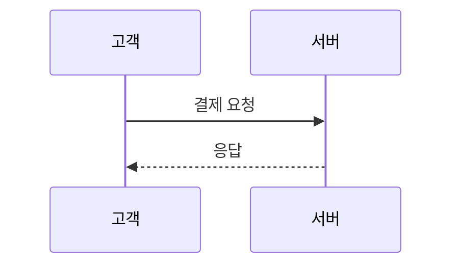
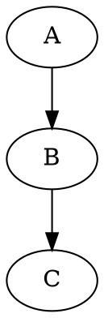

# gendocs — Claude Code 문서 생성 툴킷

## 프로젝트 정의

gendocs는 **마크다운(MD)을 원본으로, 모든 형태의 비즈니스 문서를 자동 생성**하는 Claude Code 전용 툴킷이다.
사용자가 원본 파일과 요구사항을 제공하면, Claude Code가 변환 스크립트를 작성·실행하여 최종 산출물을 만든다.

> **핵심 원칙**: 이 프로젝트에서 Claude Code는 문서 생성 전문가다. 코드를 사람이 짜는 것이 아니라, Claude Code가 기존 템플릿과 예시를 참조하여 새로운 변환 스크립트를 작성하고 실행한다.

## 작업 규칙 (Insights 2026-02-26 기반)

1. **파일 확인 필수**: 유사한 이름의 파일이 여러 개 존재할 때(예: `source/`, `doc-configs/`, 외부 경로), 편집·변환 전에 정확한 파일 경로를 사용자에게 확인한다. 추측하여 잘못된 파일을 편집하지 않는다.
2. **콘텐츠 범위 준수**: 소스 MD에 없는 내용을 추가·확장하지 않는다. 사용자가 "심플하게", "내용만 바꿔서" 등 범위를 제한하면 최소 산출물만 생성한다. 섹션 추가, 톤 변경, 브랜딩 변경은 명시적 요청이 있을 때만 수행한다.

---

## 지원 산출물 포맷

### 문서 (Document)
| 포맷 | 확장자 | 기술 스택 | 용도 | 상태 |
|------|--------|-----------|------|------|
| **Word** | .docx | Node.js + `docx` | API 명세서, 요건 정의서, 기술 문서 | 검증 완료 |
| **Excel** | .xlsx | Node.js + `exceljs` | 데이터 명세, 코드 정의서, 대사 파일 규격 | 검증 완료 |
| **PowerPoint** | .pptx | Node.js + `pptxgenjs` | 제안서, 발표 자료, 아키텍처 소개 | 예정 |
| **PDF** | .pdf | Node.js + `pdf-lib` 또는 Puppeteer | 최종 배포용 문서 | 예정 |

### 시각 자료 (Visual)
| 포맷 | 확장자 | 기술 스택 | 용도 | 상태 |
|------|--------|-----------|------|------|
| **Mermaid 다이어그램** | .png | Node.js + `@mermaid-js/mermaid-cli` | 시퀀스, 플로우차트, 상태, ER, 파이, 간트 | 검증 완료 |
| **Graphviz 다이어그램** | .png | Node.js + `@hpcc-js/wasm-graphviz` + puppeteer | 아키텍처, 네트워크 토폴로지, 의존성 그래프 | 검증 완료 |
| **시퀀스 다이어그램** | .png | Python + `matplotlib` | 시스템 간 통신 흐름도 (레거시) | 검증 완료 |

### 데이터 (Data)
| 포맷 | 확장자 | 기술 스택 | 용도 | 상태 |
|------|--------|-----------|------|------|
| **CSV** | .csv | Node.js 내장 | 데이터 추출, 단순 목록 | 예정 |
| **JSON** | .json | Node.js 내장 | API 스키마, 설정 파일 | 예정 |
| **HTML** | .html | Node.js + 템플릿 엔진 | 웹 게시용 문서, 이메일 본문 | 예정 |

---

## 사용자 플로우

### 스킬 실행 (권장)

대화형 가이드 플로우로 문서를 생성하려면 슬래시 커맨드를 사용한다:

```
/gendocs                        → 대화형 문서 생성 (아무 소스 → MD → DOCX)
/gendocs source/내문서.md       → 특정 MD 파일을 원본으로 바로 시작
/gendocs C:/경로/기존문서.docx  → 기존 DOCX를 읽어서 깔끔하게 재생성
/validate                       → 생성된 DOCX 검증 (구조 + 레이아웃 분석)
/validate output/내문서.docx    → 특정 파일 검증
```

스킬 정의: `.claude/skills/gendocs/SKILL.md`, `.claude/skills/validate/SKILL.md`

### Flow A. 신규 DOCX 생성 — 핵심 플로우 (v0.2 Generic Converter)

> 사용자: `/gendocs` 또는 "source/내문서.md를 Word로 만들어줘"

```
① 소스 입력 (아무 포맷)
   - MD 파일 → 그대로 사용
   - 기존 DOCX → extract-docx.py로 추출 → MD 자동 생성
   - 텍스트 붙여넣기 / 구두 설명 → Claude Code가 MD 작성
                    ↓
①-1 MD 셀프리뷰 (필수 — 생략 금지)
   - 생성된 MD를 읽는 사람 관점으로 재검토
   - 표현 방식(테이블/불릿/본문)의 적절성 판단
   - 반복될 패턴 문제 발견 시 프로젝트 규칙도 수정
   ※ 이 단계를 완료하기 전에 ②로 진행하지 않는다
                    ↓
② Claude Code가 doc-configs/ 참조 → doc-configs/내문서.json 작성
   - docInfo 정의 (제목, 버전, 날짜, 저자)
   - tableWidths 정의 (헤더 패턴 → 너비 매핑)
   - pageBreaks 정의 (H2/H3 break 규칙)
   - images 정의 (섹션별 이미지 매핑)
                    ↓
③ 실행
   node lib/convert.js doc-configs/내문서.json
                    ↓
④ 검증 (JSON 피드백)
   python -X utf8 tools/validate-docx.py output/내문서.docx --json
                    ↓
⑤ 자가개선 루프 (최대 4회, 조기 종료 포함)
   ├─ WARN 0건 → 완료 (PASS)
   ├─ WARN 있음 + 개선 중 → doc-config 수정 → ③ 재실행 → ④ 재검증 (FIX)
   ├─ INFO만 있음 → 완료 (SKIP, INFO는 참고용)
   ├─ 페이지 수 10%↑ → 수정 롤백 (ROLLBACK)
   ├─ WARN 수 변화 없음 → 조기 종료 (STOP_PLATEAU)
   └─ WARN 수 증감 반복 → 조기 종료 (STOP_OSCILLATION)
```

**현재 상태**: 동작함. Generic Converter + doc-config JSON으로 코드 작성 없이 문서 변환 가능.

> **레거시 방식**: 커스텀 로직이 필요한 경우 기존 `converters/` 전용 converter도 계속 사용 가능.

### Flow B. 기존 문서 수정

> 사용자: "API 명세서에 새 엔드포인트 추가해줘"

```
① source/해당문서.md 수정
                    ↓
② 기존 doc-config 확인
   - doc-configs/ 에 있으면 그대로 사용
   - 새 테이블 패턴이 추가됐으면 tableWidths에 추가
                    ↓
③ node lib/convert.js doc-configs/해당문서.json --validate → 완료
```

**현재 상태**: 동작함. source↔config 매핑은 doc-config JSON의 `source` 필드로 관리.

### Flow C. 다이어그램 포함 문서 (자동 렌더링)

> 사용자: "시퀀스 다이어그램이 포함된 기술 문서 만들어줘"

```
① source/내문서.md 에 다이어그램 코드블록 작성
   <!-- diagram: 결제 처리 흐름 -->
   ```mermaid
   sequenceDiagram
       ...
   ```
   또는 Graphviz DOT:
   <!-- diagram: 시스템 아키텍처 -->
   ```dot
   digraph { ... }
   ```
                    ↓
② doc-config에 diagrams 설정
   { "diagrams": { "enabled": true } }
                    ↓
③ node lib/convert.js doc-configs/내문서.json
   → 코드블록 자동 감지 → PNG 렌더링 → 이미지 참조로 치환 → DOCX 생성
                    ↓
④ 테마 색상 자동 매핑
   - doc-config의 theme(navy/teal/wine 등) → Mermaid/Graphviz 색상 자동 적용
   - flowchart/stateDiagram: 3색 교대 배색 (한국어 상태명 지원)
   - 시퀀스 다이어그램: 참여자 박스 + 노트에 테마 색상
   - 파이 차트: 8색 팔레트 (hue 회전)
```

**현재 상태**: 동작함. Mermaid(`mermaid-cli`) + Graphviz(`@hpcc-js/wasm-graphviz`) 자동 렌더링 + 5개 테마 색상 매핑 검증 완료.

### Flow D. 프로젝트 온보딩 (새 사용자)

```
① git clone → cd gendocs
                    ↓
② npm install && pip install -r requirements.txt
                    ↓
③ Claude Code 실행 → CLAUDE.md 자동 인식
                    ↓
④ examples/ 확인 (sample-api/, sample-batch/ 둘러보기)
                    ↓
⑤ 첫 문서 생성 시도 → Flow A 진행
```

**현재 상태**: 동작함. 의존성은 `docx`(npm) + `exceljs`(npm) + `matplotlib`(pip) 3개.

### Flow E. 새 포맷 확장 (XLSX, PPTX, PDF)

> 사용자: "Excel 코드 정의서 만들어줘"

```
① templates/{format}/ 에 템플릿 모듈 작성
   - 스타일 정의 + 요소 생성 API (DOCX의 professional.js 패턴 참조)
                    ↓
② converter 패턴 정의 (해당 포맷용)
                    ↓
③ tools/validate-{format}.py 작성 (검증 도구 확장)
                    ↓
④ examples/ 에 성공 사례 추가
                    ↓
⑤ CLAUDE.md + 기술 스택 문서 업데이트
```

**현재 상태**: XLSX 구현 완료. PPTX/PDF 미구현 (PPTX→pptxgenjs, PDF→reportlab).

---

## 고도화 로드맵

### Phase 1 — DOCX 워크플로우 완성 (v0.1, 완료)

| 항목 | 상태 | 설명 |
|------|------|------|
| professional 템플릿 | 완료 | 가로, 다크코드, 표지, 머릿글/바닥글, 이미지 |
| 변환 스크립트 패턴 | 완료 | 문서별 전용 converter 작성 |
| 구조 검증 | 완료 | validate-docx.py (XML 파싱) |
| 레이아웃 시뮬레이션 | 완료 | 페이지 높이 추정, 이미지/제목/테이블 배치 분석 |
| 이미지 삽입 + 자동 페이지 나누기 | 완료 | lookAheadForImage 패턴 |
| source↔converter 매핑 관리 | 완료 | doc-configs/ JSON으로 관리 (v0.2에서 해결) |

### Phase 2 — 자가 개선 루프 (v0.2, 완료)

| 항목 | 상태 | 설명 |
|------|------|------|
| 검증 JSON 출력 | **완료** | `validate-docx.py --json` 플래그 |
| 범용 MD→DOCX 변환기 | **완료** | `lib/converter-core.js` + `lib/convert.js` + `doc-configs/*.json` |
| 검증 피드백 루프 | **완료** | `/gendocs` 스킬 6단계: PASS/FIX/SKIP/ROLLBACK 판정, 최대 4회 |
| XSD 스키마 검증 | 미완 | OOXML 규격 검증 |
| 역파싱 검증 | 미완 | DOCX→텍스트 추출 → 원본 MD 비교 |

### Phase 2.5 — 자가개선 고도화 (v0.3, 현재)

| 항목 | 상태 | 설명 |
|------|------|------|
| 회귀 테스트 | **완료** | `tools/regression-test.js` — 7개 baseline 비교 (Golden File) |
| 성공 패턴 추출 | **완료** | `tools/extract-patterns.js` → `lib/patterns.json` (common/byDocType) |
| 규칙 충돌 감지 | **완료** | `tools/check-rules.js` + regression-test 게이트 |
| 시각적 검증 | **완료** | `tools/visual-verify.py` (LibreOffice → PDF → 이미지, 선택적) |
| 경험 기억 (Reflexion) | **완료** | `lib/reflections.json` — 교정 경험 저장·재활용, 반복 FIX 감소 |
| 조기 종료 + 델타 추적 | **완료** | 6단계 루프 개선: PLATEAU/OSCILLATION 감지, 최적 결과 보존 |
| 다차원 품질 점수 | **완료** | `tools/score-docx.js` — 5차원 1-10 점수 + 시계열 추적 |
| 패턴 붕괴 방지 | **완료** | `extract-patterns.js --audit` — 출처 추적 + 다양성 메트릭 |
| lint-md.py 확장 | **완료** | 5개 검사 추가 (중첩 불릿, 8+ 컬럼, 이미지 참조, 언어 태그, 섹션 균형) |
| 파이프라인 진단 | **완료** | `tools/pipeline-audit.js` — 5단계 통합 진단 + 근본 원인 매핑 |

### Phase 3 — 포맷 확장 (v0.4)

| 포맷 | 패키지 | 언어 | 우선순위 | 상태 |
|------|--------|------|----------|------|
| XLSX | exceljs | Node.js | 높음 (데이터 명세, 코드 정의서 수요) | **완료** |
| PPTX | pptxgenjs | Node.js | 중간 (제안서, 발표 자료) | 미완 |
| PDF | reportlab | Python | 낮음 (DOCX→PDF 변환으로 대체 가능) | 미완 |

포맷별로 필요한 것: 템플릿 모듈 + converter 패턴 + 검증 도구 + 성공 사례

### Phase 4 — 자동화 (v0.4)

| 항목 | 상태 | 설명 |
|------|------|------|
| MD 내 다이어그램 자동 렌더링 | **완료** | Mermaid/Graphviz 코드블록 → PNG 자동 생성 + 테마 색상 매핑 |
| 시각적 검증 | **완료** | LibreOffice → PDF → 이미지 → 빈 페이지 감지 |
| 배치 생성 | 미완 | 여러 source 파일을 한번에 변환 |
| 변경 감지 | 미완 | source/ 파일 변경 시 자동 재생성 |

---

## 폴더 구조

```
gendocs/
├── CLAUDE.md                        ← [핵심] 이 파일. Claude Code 지시서
├── PROJECT_PLAN.md                  ← 프로젝트 로드맵
├── package.json                     ← Node.js 의존성 (docx, exceljs)
├── requirements.txt                 ← Python 의존성 (matplotlib)
│
├── .claude/skills/                  ← 슬래시 커맨드 (Skills)
│   ├── gendocs/SKILL.md             ← /gendocs — 대화형 문서 생성 플로우
│   └── validate/SKILL.md            ← /validate — 문서 검증
│
├── lib/                             ← [v0.2] Generic Converter 엔진
│   ├── converter-core.js            ← 공통 DOCX 변환 로직 (파싱, 너비 계산, 변환, 빌드)
│   ├── converter-xlsx.js            ← [v0.6] XLSX 변환 엔진 (시트 분할, 테이블 렌더링)
│   ├── convert.js                   ← 진입점: node lib/convert.js <config.json> (DOCX/XLSX 자동 라우팅)
│   ├── theme-utils.js               ← [v0.5] 테마 색상 유틸리티 (tint/shade, 12→30 파생)
│   ├── diagram-renderer.js          ← [v0.4] 다이어그램 자동 렌더링 (Mermaid/Graphviz + 테마 매핑)
│   ├── scoring.js                   ← [v0.4] 다차원 품질 점수 계산 (순수 함수 모듈)
│   ├── patterns.json                ← [v0.3] 공유 패턴 DB (tableWidths common/byDocType)
│   └── reflections.json             ← [v0.4] 에피소딕 메모리 (교정 경험 저장)
│
├── doc-configs/                     ← [v0.2] 문서별 설정 파일 (JSON, 사용자 생성)
│   └── (사용자가 /gendocs로 자동 생성)
│
├── source/                          ← 사용자 원본 파일 (입력)
│   └── (사용자의 원본 MD 파일)
│
├── output/                          ← 생성된 최종 문서 (출력)
│
├── themes/                          ← 테마 프리셋 JSON (5종, v2 슬롯 기반)
│   ├── office-standard.json         ← Office 2013-2022 (기본)
│   ├── office-modern.json           ← Office 2023
│   ├── blue-warm.json               ← Blue Warm (로열블루)
│   ├── blue-green.json              ← Blue Green (틸)
│   └── marquee.json                 ← Marquee (스틸블루)
│
├── templates/                       ← 포맷별 문서 템플릿
│   ├── docx/
│   │   ├── basic.js                 ← 기본 (세로, 심플)
│   │   └── professional.js          ← 고급 (가로, 다크코드, 머릿글/바닥글, 이미지)
│   ├── diagram/
│   │   └── sequence.py              ← 시퀀스 다이어그램 기본 템플릿
│   ├── xlsx/
│   │   ├── data-spec.js             ← [v0.6] 데이터 명세 (표지, 헤더 스타일, 교대행)
│   │   └── basic.js                 ← [v0.6] 기본 (표지 없이 심플)
│   ├── pptx/                        ← (예정)
│   └── pdf/                         ← (예정)
│
├── converters/                      ← 레거시 전용 변환 스크립트 (커스텀 로직용)
│
├── diagrams/                        ← 다이어그램 생성 스크립트 (사용자 생성)
│
├── examples/                        ← 성공 사례 (레퍼런스)
│   ├── sample-api/                  ← BookStore API 명세서 예제 (DOCX)
│   │   ├── source.md                ← 원본 MD
│   │   └── doc-config.json          ← 변환 설정
│   ├── sample-batch/                ← 주문처리 배치 규격서 예제 (DOCX)
│   │   ├── source.md
│   │   └── doc-config.json
│   └── sample-code-def/             ← 공통 코드 정의서 예제 (XLSX)
│       ├── source.md
│       └── doc-config.json
│
├── tests/                           ← [v0.3] 회귀 테스트
│   ├── golden/                      ← baseline 스냅샷 (문서별 stats JSON)
│   └── scores/                      ← [v0.4] 품질 점수 히스토리 (문서별 시계열)
│
└── tools/                           ← 검증·디버그·유틸리티
    ├── theme_colors.py              ← [v0.5] 테마 색상 동적 로드 (검증 도구 공유 모듈)
    ├── validate-docx.py             ← [핵심] DOCX 구조 검증 + 레이아웃 분석 (--json 지원)
    ├── validate-xlsx.js             ← [v0.6] XLSX 구조 검증 (시트/테이블/헤더 분석, --json 지원)
    ├── extract-docx.py              ← [핵심] DOCX 텍스트 추출 (ZIP+XML, 의존성 없음, --json 지원)
    ├── regression-test.js           ← [v0.3] 회귀 테스트 (baseline 비교)
    ├── create-baselines.js          ← [v0.3] baseline 생성
    ├── extract-patterns.js          ← [v0.3] 성공 패턴 추출 → lib/patterns.json
    ├── score-docx.js                ← [v0.4] 다차원 품질 점수 CLI (단일/배치)
    ├── pipeline-audit.js            ← [v0.5] 파이프라인 진단 (5단계 통합 + 근본 원인)
    ├── create-score-baselines.js    ← [v0.4] 점수 baseline 생성
    ├── check-rules.js               ← [v0.3] 규칙 충돌 감지
    ├── review-docx.py               ← [v0.3] AI 셀프리뷰 (너비 불균형, 콘텐츠 정합성, 이미지 비율, 품질 검사)
    ├── lint-md.py                   ← [v0.3] MD 구조 린트 (11가지 검사: 메타데이터~섹션 균형)
    ├── visual-verify.py             ← [v0.3] 시각적 검증 (LibreOffice 필요)
    ├── convert-to-docx.js           ← 초기 프로토타입 변환기
    ├── debug-convert.js             ← 변환 디버깅 도구
    └── debug-parser.js              ← MD 파싱 디버깅 도구
```

---

## 템플릿 시스템

### 설계 원칙
- 각 출력 포맷마다 독립된 템플릿 모듈이 존재한다
- 템플릿은 **스타일 정의 + 요소 생성 API**를 제공한다
- 변환 스크립트는 템플릿의 공개 API만 호출하여 문서를 조립한다
- 새 문서를 만들 때 템플릿을 수정하지 않는다. 변환 스크립트만 새로 작성한다

### Word (DOCX) 템플릿 — 검증 완료

**basic.js** — 세로 레이아웃, 심플 스타일
- 공개 API: `h1`, `h2`, `h3`, `text`, `bullet`, `note`, `infoBox`, `warningBox`, `pageBreak`, `spacer`, `createCodeBlock`, `createSimpleTable`, `createTable`, `createCoverPage`, `createDocument`, `saveDocument`

**saveDocument EBUSY 처리**: `saveDocument()`는 파일이 열려있을 때(EBUSY) 자동으로 해당 프로세스(Word 등)를 종료하고 최대 3회 재시도한다. Windows 환경에서 PowerShell로 프로세스 감지 후 종료, 실패 시 `taskkill /IM WINWORD.EXE /F` 폴백.

**맞춤법/문법 오류 숨기기**: `saveDocument()`는 `Packer.toBuffer()` 후 디스크에 쓰기 전에 `adm-zip`으로 DOCX 버퍼 내 `word/settings.xml`에 `<w:hideSpellingErrors/>`와 `<w:hideGrammaticalErrors/>`를 삽입한다. 이를 통해 생성된 문서를 Word에서 열 때 맞춤법/문법 오류 표시가 자동으로 비활성화된다.

**professional.js** — 가로 레이아웃, 프로페셔널 스타일
- 추가 API: `h4`, `labelText`, `flowBox`, `createImage`, `createJsonBlock`, `createSyntaxCodeBlock`
- 특징: 다크테마 코드블록, 로고 표지, 머릿글/바닥글(페이지 번호), 이미지 삽입

### Excel (XLSX) 템플릿 — 검증 완료

**data-spec.js** — 데이터 명세용 (표지 포함)
- 공개 API: `createWorkbook`, `saveWorkbook`, `addSheet`, `addCoverSheet`, `writeTitle`, `writeText`, `writeBullet`, `writeInfoBox`, `writeWarningBox`, `writeTable`, `writeCodeBlock`, `applyAutoFilter`, `freezeHeaderRow`, `setColumnWidths`
- 특징: 테마 색상 헤더, 교대행 배경, 자동 필터, 행 고정, A4 가로 인쇄 설정

**basic.js** — 심플 (표지 없음)
- data-spec과 동일 API, `addCoverSheet`는 no-op
- 용도: 간단한 데이터 목록, 빠른 내보내기

**XLSX 변환 엔진** (`lib/converter-xlsx.js`):
- `converter-core.js`의 유틸리티 재사용 (parseTable, resolveTheme 등)
- H2 기준 시트 분할 (`sheetMapping: "h2"`)
- `sheetMapping: "single"` → 전체 1시트, `"table"` → 테이블마다 시트
- `tableWidths` 값은 Excel 문자 폭 단위 (DOCX의 DXA와 다름)

### Generic Converter 사용법 (v0.2, 권장)

새 문서를 변환할 때는 `doc-configs/` 에 JSON 설정 파일만 작성하면 된다.

```bash
# 실행
node lib/convert.js doc-configs/내문서.json

# 실행 + 검증
node lib/convert.js doc-configs/내문서.json --validate
```

**doc-config JSON 구조**:
```json
{
  "source": "source/내문서.md",
  "output": "output/내문서_{version}.docx",
  "template": "professional",
  "theme": "navy-professional",
  "_meta": { "createdBy": "ai", "createdAt": "2026-01-01" },
  "style": { "colors": { "accent": "FF6B35" } },
  "h1CleanPattern": "^# 문서제목",
  "headerCleanUntil": "## 변경 이력",
  "docInfo": {
    "title": "문서 제목", "subtitle": "부제목", "version": "v1.0",
    "author": "작성자", "company": "회사", "createdDate": "2026-01-01", "modifiedDate": "2026-01-01"
  },
  "tableWidths": {
    "헤더1|헤더2|헤더3": [w1, w2, w3]
  },
  "pageBreaks": {
    "afterChangeHistory": true,
    "h2BreakBeforeSection": 4,
    "imageH3AlwaysBreak": true,
    "changeDetailH3Break": false,
    "defaultH3Break": true,
    "h2Sections": [],
    "h3Sections": [],
    "noBreakH3Sections": []
  },
  "images": {
    "basePath": "examples/api-spec",
    "sectionMap": { "1.1": { "file": "image.png", "width": 780, "height": 486 } }
  }
}
```

**XLSX doc-config JSON 구조**:
```json
{
  "source": "source/코드정의서.md",
  "output": "output/코드정의서_{version}.xlsx",
  "format": "xlsx",
  "template": "data-spec",
  "theme": "office-modern",
  "docInfo": { "title": "...", "version": "v1.0", ... },
  "xlsx": {
    "sheetMapping": "h2",
    "coverSheet": true,
    "freezeHeaders": true,
    "autoFilter": true
  },
  "tableWidths": {
    "코드|코드명|설명": [12, 20, 45]
  }
}
```
- `format: "xlsx"` 또는 output 확장자가 `.xlsx`이면 XLSX 변환
- `tableWidths` 값은 Excel 문자 폭 단위 (DOCX의 DXA가 아님)
- `sheetMapping`: `"h2"` (H2마다 시트, 기본), `"single"` (전체 1시트), `"table"` (테이블마다 시트)

**핵심 파일**:
- `lib/converter-core.js` — 공통 DOCX 변환 엔진 (파싱, 너비 계산, 요소 변환, 빌드)
- `lib/converter-xlsx.js` — XLSX 변환 엔진 (시트 분할, 테이블 렌더링)
- `lib/convert.js` — CLI 진입점 (`node lib/convert.js <config.json> [--validate]`, DOCX/XLSX 자동 라우팅)

> **레거시 방식**: 커스텀 로직이 필요한 경우 `converters/` 에 전용 변환 스크립트를 작성할 수 있다. `examples/api-spec/convert.js`, `examples/hipass-batch/convert.js` 참조.

### 페이지 나누기 규칙

- **표지 → 변경이력**: 자동 (createCoverPage에 포함)
- **변경이력 → 본문**: 2번째 H2 앞에서만 명시적 pageBreak()
- **본문 내 H2 간**: 페이지 나누기 없음 (연속 흐름)
- **이미지 포함 섹션**: H3 파싱 시 look-ahead로 `![` 감지 → 해당 H3 앞에 pageBreak()하여 제목+이미지를 같은 페이지에 배치. 단, H2 직후 첫 H3이면 H2에서 이미 break했으므로 중복 break 생략
```javascript
// 이미지 섹션 look-ahead 패턴
function lookAheadForImage(lines, startIdx) {
  for (let j = startIdx; j < lines.length; j++) {
    const l = lines[j].trim();
    if (l.startsWith('#')) return false;  // 다음 섹션이면 중단
    if (l.match(/^!\[/)) return true;     // 이미지 발견
  }
  return false;
}

// H3 처리에서 사용 (이미지 섹션 + 중복 break 방지)
if (line.startsWith('### ')) {
  const hasImage = lookAheadForImage(lines, i + 1);
  if (hasImage && !isFirstH3AfterH2) {
    elements.push(t.pageBreak());
  }
  elements.push(t.h3(line.substring(4).trim()));
}
```

> **H4 고아 제목**: 검증기에서 INFO로 감지되지만, converter에서 일괄 break를 넣으면 페이지가 과도하게 늘어난다. INFO 권장사항은 참고용이며, 필요한 경우에만 특정 H4에 수동으로 break를 추가한다.

---

## 테마 시스템

### 개요

DOCX 스타일(색상, 폰트, 크기)을 JSON 테마 파일로 분리하여 문서마다 다른 색상/폰트를 적용할 수 있다.
Word 표준 12슬롯(dk1/lt1/dk2/lt2/accent1-6/hlink/folHlink)에서 30키 colors를 자동 파생하는 v2 구조.

**Fallback 체인**: `doc-config "style"` > `theme JSON (slots → colors 파생)` > `템플릿 DEFAULT`

### 프리셋 테마 (5종, Office 표준 팔레트)

| 파일 | 이름 | 팔레트 출처 | dk2 (primary) | 용도 |
|------|------|-----------|---------------|------|
| `themes/office-standard.json` | Office Standard | Office 2013-2022 | #44546A | 기본 (가장 보편적) |
| `themes/office-modern.json` | Office Modern | Office 2023 | #0E2841 | 최신 트렌드 |
| `themes/blue-warm.json` | Blue Warm | Blue Warm | #242852 | 로열블루, 격식 |
| `themes/blue-green.json` | Blue Green | Blue Green | #373545 | 틸, 기업용 |
| `themes/marquee.json` | Marquee | Marquee | #5E5E5E | 스틸블루, 모던 |

**기존 테마명 호환**: converter-core.js의 THEME_ALIASES가 자동 매핑
- `navy-professional` → `office-standard`
- `blue-standard` → `office-modern`
- `teal-corporate` → `blue-green`
- `slate-modern` → `marquee`
- `wine-elegant` → `blue-warm`

### doc-config에서 사용

```json
{
  "source": "source/my-doc.md",
  "template": "professional",
  "theme": "office-standard",
  "style": {
    "colors": { "accent": "FF6B35" }
  },
  "docInfo": { ... }
}
```

- `"theme"` 생략 → 템플릿 기본값
- `"style"` 생략 → 테마 그대로
- 둘 다 생략 → 현재와 100% 동일 (하위 호환)
- 기존 테마명(`navy-professional` 등) 사용 가능 (자동 매핑)

### 테마 JSON 구조 (v2)

```json
{
  "name": "office-standard",
  "displayName": "Office Standard",
  "version": 2,
  "slots": {
    "dk1": "000000", "lt1": "FFFFFF",
    "dk2": "44546A", "lt2": "E7E6E6",
    "accent1": "4472C4", "accent2": "ED7D31",
    "accent3": "A5A5A5", "accent4": "FFC000",
    "accent5": "5B9BD5", "accent6": "70AD47",
    "hlink": "0563C1", "folHlink": "954F72"
  },
  "fonts": { "default": "Malgun Gothic", "code": "Consolas" },
  "sizes": { ... },
  "syntax": { ... },
  "overrides": {}
}
```

- `slots` — Word 12슬롯이 색상의 소스 오브 트루스
- `overrides` — 파생 결과를 부분적으로 덮어쓸 수 있음 (예: `codeDarkBg` 고정)
- `version: 2` — v1(기존 `colors` 30키)과 구분

### 12슬롯 → 30키 파생 매핑

| 파생 키 | 소스 | 변환 |
|---------|------|------|
| primary | dk2 | 직접 |
| secondary | accent1 | 직접 |
| accent | accent2 | 직접 |
| text | dk1 | 직접 |
| white | lt1 | 직접 |
| altRow | lt2 | 직접 |
| textLight | dk1 | tint 50% |
| border | dk2 | tint 70% |
| infoBox | dk2 | tint 85% |
| warningBox | accent2 | tint 88% |
| codeDarkBg | — | 고정 1E1E1E |
| codeDarkBorder | — | 고정 3C3C3C |

핵심 함수: `lib/theme-utils.js`의 `deriveColors(slots, overrides)`

### 기술 구현

- `lib/theme-utils.js` — tint/shade, 12→30 파생, v1 마이그레이션 (순수 함수 모듈)
- 템플릿(`professional.js`, `basic.js`)은 **factory function 패턴**으로 구현: `module.exports = createTemplate`
- `converter-core.js`의 `resolveTheme()` → v2 감지 → `deriveColors()` → style 오버라이드 머지
- `converter-core.js`의 `THEME_ALIASES` → 기존 테마명 → 신규 테마명 자동 매핑
- `loadTemplate(templateName, themeConfig)` → factory 호출
- 검증 도구 → `tools/theme_colors.py`에서 동적으로 테마 색상 세트 로드

---

## 스타일 가이드

### 공통 디자인 토큰
| 요소 | 값 (office-standard 테마 기준) |
|------|-----|
| 기본 폰트 | Malgun Gothic (맑은 고딕) |
| 코드 폰트 | Consolas |
| 주 색상 (Primary/dk2) | #44546A (슬레이트 블루) |
| 보조 색상 (Secondary/accent1) | #4472C4 |
| 강조 색상 (Accent/accent2) | #ED7D31 (오렌지) |
| 본문 색상 (dk1) | #000000 |
| 테이블 헤더 배경 | dk2, 글자 lt1 |
| 테이블 교대 행 (lt2) | #E7E6E6 |
| 다크 코드 배경 | #1E1E1E (모든 테마 고정) |

### Word 문서 규칙
- 가로(Landscape) 레이아웃을 기본으로 사용 (테이블이 많은 기술 문서 특성)
- 표지 → 변경 이력 → 본문 순서
- 코드 블록: JSON은 회색 배경, 프로그래밍 코드는 다크테마
- 테이블 컬럼 너비는 헤더 패턴 매칭으로 자동 계산

---

## DOCX 텍스트 추출 (extract-docx.py)

기존 DOCX 파일에서 콘텐츠를 추출하여 MD를 자동 생성할 때 사용한다.
ZIP+XML 방식으로 내장 모듈만 사용하며(의존성 없음), python-docx 대비 **2.4~3.0배 빠르다**.

```bash
# 텍스트 리포트 (통계 + 구조화된 텍스트)
python -X utf8 tools/extract-docx.py output/문서.docx

# JSON 출력 (프로그래밍 활용)
python -X utf8 tools/extract-docx.py output/문서.docx --json
```

**추출 요소 분류** (셀 배경색 기반 자동 판별):
| 요소 | 판별 기준 |
|------|----------|
| `heading` | 스타일명 Heading1~6 |
| `table` | 데이터 테이블 (네이비/화이트 헤더) |
| `codeBlock` (dark) | 배경색 #1E1E1E / #2D2D2D |
| `codeBlock` (light) | 배경색 #F5F5F5 / #F0F0F0, 단일 컬럼 |
| `infoBox` | 배경색 #E8F0F7, 단일 컬럼 |
| `warningBox` | 배경색 #FEF6E6, 단일 컬럼 |
| `listItem` | ListParagraph 스타일 |
| `paragraph` | 일반 텍스트 |

---

## 다이어그램 자동 렌더링

### 개요

MD 내 다이어그램 코드블록(`mermaid`, `dot`, `graphviz`)을 자동으로 PNG로 렌더링하여 문서에 삽입한다. `<!-- diagram: 설명 -->` 주석이 있는 코드블록만 렌더링 (opt-in).

**핵심 파일**: `lib/diagram-renderer.js`

### 지원 렌더러

| 렌더러 | 언어 태그 | 엔진 | 다이어그램 유형 |
|--------|-----------|------|----------------|
| Mermaid | `mermaid` | `@mermaid-js/mermaid-cli` (mmdc) | 시퀀스, 플로우차트, 상태, ER, 파이, 간트, 클래스 |
| Graphviz | `dot`, `graphviz` | `@hpcc-js/wasm-graphviz` + puppeteer(SVG→PNG) | 아키텍처, 네트워크, 의존성 그래프 |

### 사용법

```markdown
<!-- diagram: 결제 처리 시퀀스 -->


<!-- diagram: 시스템 구조 -->

```

doc-config에 `diagrams` 설정:
```json
{ "diagrams": { "enabled": true, "width": 1024, "scale": 2 } }
```

### 테마 색상 매핑

doc-config의 `theme` 설정(navy-professional 등)이 다이어그램 색상에 자동 매핑된다.

- **Mermaid**: `buildMermaidConfig()` → themeVariables JSON config 파일 생성 → `mmdc -c` 플래그
- **Graphviz**: `injectGraphvizTheme()` → DOT 소스에 node/edge 속성 주입
- **다색 배색** (3가지 다이어그램 유형):
  - **sequenceDiagram**: SVG 후처리로 참여자별 개별 색상 (mmdc→SVG→rect recolor→svgToPng→PNG). 테마 accent 슬롯에서 중간~진한 톤 색상 생성, 흰색 텍스트. 사용자 `box` 구문이 있으면 후처리 스킵.
  - **stateDiagram**: 의미론적 색상 (SUCCESS→녹색, FAILURE→코랄, WARNING→피치, 나머지→테마 primary)
  - **flowchart**: `classDef` + `class` 구문 자동 주입 (3색 교대)
  - stateDiagram (ASCII): `class` 구문, (한국어): `:::className` 인라인 구문
- **Graphviz 색상 치환**: 사용자 `fillcolor` 있어도 색상 가족 감지 → 테마 대응색 치환 + 폰트/엣지 항상 주입
- 사용자가 직접 `classDef`/진한 `fillcolor`를 지정한 경우 → 건드리지 않음

### 하위 호환

- `<!-- diagram: -->` 주석이 없는 mermaid/dot 코드블록 → 일반 코드블록으로 변환 (기존 동작)
- `diagrams.enabled: false` → 다이어그램 렌더링 스킵
- `diagrams.theme` 명시 시 → Mermaid 기본 테마 사용 (gendocs 테마 매핑 비활성)
- 테마 없이 사용 → Mermaid 기본 테마 (연보라색)

---

## 검증 체계

### 개요

변환 전후 3종의 검증을 수행한다:

0. **MD 린트** (`tools/lint-md.py`) — 변환 전 MD 구조 검사 (11가지: 메타데이터, 구분선, 변경이력, 코드블록 균형, TOC, HTML, 중첩 불릿, 8+ 컬럼, 이미지 참조, 언어 태그, 섹션 균형)
1. **레이아웃 검증** (`tools/validate-docx.py`) — 구조 검증 + 페이지 레이아웃 시뮬레이션
2. **AI 셀프리뷰** (`tools/review-docx.py`) — 콘텐츠 정합성 + 컬럼 너비 불균형 + 품질 검사

```bash
# MD 린트 (변환 전)
python -X utf8 tools/lint-md.py source/문서.md --json
python -X utf8 tools/lint-md.py source/*.md              # 배치 모드

# 레이아웃 검증
python -X utf8 tools/validate-docx.py output/문서.docx --json

# AI 셀프리뷰 (소스 비교 포함)
python -X utf8 tools/review-docx.py output/문서.docx --config doc-configs/문서.json --json

# AI 셀프리뷰 (단독)
python -X utf8 tools/review-docx.py output/문서.docx --json

# 변환 + 레이아웃 검증 한 번에
node lib/convert.js doc-configs/문서.json --validate
```

**자동 수정 원칙**:
- **WARN**만 자동 수정 대상 (이미지 배치, 콘텐츠 누락 등 명확한 문제)
- **SUGGEST** — 컬럼 너비 재분배 등 명확한 개선이면 적용
- **INFO**는 참고용 — 일괄 수정 금지 (시뮬레이션 추정치와 실제 Word 렌더링은 다를 수 있음)
- 수정 후 페이지 수가 10% 이상 증가하면 과도한 수정. 롤백 후 개별 검토
- 패턴 매칭 일괄 break 삽입 금지 — 특정 위치만 수정

```
생성 → 레이아웃 검증 → AI 셀프리뷰 → WARN/SUGGEST 수정 → 재생성 → 재검증 (최대 4회)
```

### 검증 항목

**구조 검증** (자동)
- 머릿글/바닥글 존재 여부
- 제목 계층 건너뛰기 감지 (H2 → H4 등)
- 연속 페이지 나누기 감지 (빈 페이지 발생)
- 요소 통계: 제목, 테이블, 코드블록, 이미지, 불릿 카운트

**페이지 레이아웃 시뮬레이션** (자동)

XML에서 각 요소의 높이를 추정하여 가로 A4 기준(가용 높이 ~457pt)으로 페이지 배치를 시뮬레이션한다.

| 요소 | 추정 높이 |
|------|----------|
| H2 | 42pt |
| H3 | 34pt |
| 일반 단락 | 22pt × 줄 수 |
| 불릿 | 20pt |
| 테이블 | 헤더 28pt + 행당 22pt |
| 이미지 | XML extent에서 실제 크기 읽음 (EMU→pt) + 30pt |
| 빈 단락/spacer | 8pt |

**레이아웃 권장사항** (3가지 규칙)

| 규칙 | 감지 조건 | 심각도 | 조치 |
|------|----------|--------|------|
| 이미지 독립 배치 | 이미지가 명시적 break 없이 다른 콘텐츠와 같은 페이지 | WARN | 이미지 섹션 앞에 pageBreak() 추가 |
| 고아 제목 | 제목 아래 60pt 미만 공간 (제목만 달랑 남음) | INFO | 제목 앞에 pageBreak() 추가 고려 |
| 테이블 분할 | 큰 테이블이 페이지 40% 이하 공간에서 시작 | INFO | 테이블 앞 break 또는 크기 조정 |

**오버플로우 허용 규칙**: 이미지가 시뮬레이션 상 자동 오버플로우로 다음 페이지에 배치되더라도, 이전 페이지가 명시적 break로 시작되었고 해당 이미지의 섹션 제목이 이전 페이지에 있으면 의도된 배치로 판단하여 WARN을 발생시키지 않는다. (제목+이미지가 break 이후 연속 배치된 경우)

### 검증 리포트 예시

```
페이지 레이아웃 분석 (추정, 가용 높이 457pt)
──────────────────────────────────────────
  p. 1  ███░░░░░░░░░░░░░░░░░  17.9% (82pt)
  p. 2  █████░░░░░░░░░░░░░░░  26.7% (122pt) [표1]
  p. 3  ██████████████████░░  90.6% (414pt) [표1]
  p. 6  ██████████████████░░  94.7% (433pt) [이미지]

  [WARN] p.6 이미지(510x315pt)가 이전 콘텐츠와 같은 페이지에 배치됨
       → 섹션 "3.3 예시 다이어그램" 앞에 페이지 나누기를 추가하면 깔끔하게 표시됩니다
```

### AI 셀프리뷰 (review-docx.py, v0.3)

변환된 DOCX의 콘텐츠 품질을 자동 분석한다. validate-docx.py가 레이아웃을 검증하는 반면, review-docx.py는 콘텐츠 정합성과 테이블 가독성에 집중한다.

```bash
# 소스 비교 포함
python -X utf8 tools/review-docx.py output/문서.docx --config doc-configs/문서.json --json

# 단독 (소스 비교 없이)
python -X utf8 tools/review-docx.py output/문서.docx --json
```

**검사 항목 (7가지)**:

| 검사 | 유형 | 심각도 | 설명 |
|------|------|--------|------|
| 콘텐츠 정합성 | CONTENT_MISSING / CONTENT_EXTRA | WARN / INFO | 소스 MD vs DOCX 요소 수 비교 |
| 컬럼 너비 불균형 | WIDTH_IMBALANCE | SUGGEST | 줄바꿈 컬럼 + 빈 인접 컬럼 → 너비 재분배 제안 |
| 넓은 낭비 | WIDE_WASTE | INFO | 컬럼 활용률 30% 미만 |
| 테이블 가독성 | TOO_MANY_COLUMNS / CELL_OVERFLOW / EMPTY_COLUMN | INFO | 8+ 컬럼, 4줄+ 셀, 빈 컬럼 |
| 코드 무결성 | TRUNCATED_JSON / EMPTY_CODE | WARN | 잘린 JSON, 빈 코드블록 |
| 제목 구조 | DUPLICATE_HEADING / LONG_SECTION | WARN / INFO | 연속 동일 제목, H3 없는 긴 섹션 |
| 이미지 비율 | NARROW_IMAGE / FLAT_IMAGE | WARN | 다이어그램 폭 < 30% 또는 높이 < 80pt |

**심각도 체계**:

| 심각도 | 의미 | 처리 |
|--------|------|------|
| WARN | 명확한 문제 | Claude Code 자동 수정 |
| SUGGEST | 개선 기회 | doc-config tableWidths 업데이트 → 재변환 |
| INFO | 참고 관찰 | 사용자에게 보고만 |

### 회귀 테스트 (v0.3)

converter-core.js, templates, SKILL.md 등 공통 코드를 수정할 때 기존 7개 문서가 깨지지 않는지 자동 검증한다.

```bash
# baseline 생성 (최초 1회 또는 갱신 시)
node tools/create-baselines.js
node tools/create-baselines.js --force  # 기존 baseline 덮어쓰기

# 회귀 테스트 실행
node tools/regression-test.js
node tools/regression-test.js --verbose         # 상세 diff
node tools/regression-test.js --name api-spec   # 특정 문서만
```

**비교 허용 범위**:

| 항목 | 허용 범위 |
|------|----------|
| estimatedPages | ±2 |
| headings, headingsByLevel | 정확 일치 |
| tables, codeBlocks, images, infoBoxes | 정확 일치 |
| bullets | ±2 |
| pageBreaks | 정확 일치 |
| warnCount | 같거나 감소만 |

**사용 시점**: converter-core.js, templates, doc-config 공통 로직, 규칙(SKILL.md/MEMORY.md) 수정 후 반드시 실행.

### 성공 패턴 DB (v0.3)

성공한 doc-config에서 재사용 가능한 tableWidths 패턴을 추출하여 `lib/patterns.json`에 저장한다.

```bash
# 패턴 추출 (변환 성공 후 실행)
node tools/extract-patterns.js
```

**fallback 체인** (converter-core.js `calculateTableWidths`):
1. doc-config `tableWidths` (명시적 설정)
2. `lib/patterns.json` common (3개+ 문서에서 공유)
3. `lib/patterns.json` byDocType (문서 유형별)
4. defaultTableWidths (가중치 기반)

**승격 규칙**: 3개 이상 doc-config에서 동일 너비로 사용 → common 승격.

### 규칙 충돌 감지 (v0.3)

규칙(SKILL.md, MEMORY.md, CLAUDE.md) 변경 시 기존 규칙과 모순되지 않는지 검증한다.

```bash
# 정적 규칙 스캔 (보조)
node tools/check-rules.js

# 핵심 메커니즘: 회귀 테스트 게이트
node tools/regression-test.js
```

**플로우**: 규칙 변경 → regression-test → FAIL이면 충돌 의심 → 원복 또는 조정.

### 시각적 검증 (v0.3, 선택적)

XML 시뮬레이션이 아닌 실제 렌더링 결과로 레이아웃을 검증한다. LibreOffice + pdf2image + Poppler 필요.

```bash
python -X utf8 tools/visual-verify.py output/문서.docx
python -X utf8 tools/visual-verify.py output/문서.docx --json
python -X utf8 tools/visual-verify.py output/문서.docx --save-images
```

**검증 단계**:
- 4a: 페이지 수 비교 (validate 추정 vs 실제 렌더링)
- 4b: 빈 페이지 감지 (95% 이상 흰색 픽셀)
- 4c: 플래그된 페이지 이미지를 Claude Code가 시각 리뷰

### 경험 기억 (Episodic Memory, v0.4)

교정 경험을 `lib/reflections.json`에 저장하고, 유사 문서 생성 시 참조하여 FIX 반복을 감소시킨다.

- **기록 시점**: FIX 성공, ROLLBACK, SUGGEST 적용, PASS (WARN 0)
- **주입 시점**: SKILL.md 5-1 (doc-config 작성 전, reflections 조회)
- **매칭**: docType > tags > issue.type
- **크기 제한**: 200개, PASS 먼저 삭제, ROLLBACK 보존
- **승격**: 3개+ 문서 동일 tableWidths fix → patterns.json common (extract-patterns.js)

### 조기 종료 (Early Termination, v0.4)

레이아웃 자가개선 루프에서 무의미한 반복을 감지하고 조기 종료한다.

- **STOP_PLATEAU**: 2회 연속 동일 WARN 수 → 진전 없음으로 판정
- **STOP_OSCILLATION**: 3회 연속 WARN 수 방향 전환 (↑↓↑) → 진동으로 판정
- **STOP_MAX**: 4회 도달 → 기존과 동일
- **최적 복원**: 조기 종료 시 최소 WARN 반복의 doc-config로 복원 후 재변환
- **Reflexion 기록**: 조기 종료 사유 + WARN 추이를 reflections.json에 기록

### 다차원 품질 점수 (v0.4)

문서 품질을 5차원 1-10 점수로 정량화한다. 기존 PASS/FIX/SKIP/ROLLBACK 판정은 그대로 유지하며, 점수는 보완 정보.

**5차원 + 가중치**:

| 차원 | 가중치 | 데이터 소스 | 의미 |
|------|--------|-------------|------|
| content | 0.30 | review-docx `contentFidelity` | 소스 대비 콘텐츠 충실도 |
| layout | 0.25 | validate-docx `issues[]` + `pages[]` + review-docx `NARROW_IMAGE/FLAT_IMAGE` | 페이지 배치 품질 |
| table | 0.20 | review-docx `tableWidths` + `tableReadability` | 테이블 가독성 |
| code | 0.15 | review-docx `codeIntegrity` | 코드블록 무결성 |
| structure | 0.10 | validate `hasHeader/Footer` + review `headingStructure` | 구조 완성도 |

**CLI 사용법**:

```bash
node tools/score-docx.js doc-configs/문서.json                # 단일 점수
node tools/score-docx.js doc-configs/문서.json --save          # 점수 + tests/scores/ 저장
node tools/score-docx.js --batch                               # 전체 문서
node tools/score-docx.js --batch --save                        # 전체 + 저장
node tools/score-docx.js --batch --skip-convert                # 기존 DOCX 사용 (빠름)
```

**점수 히스토리**: `tests/scores/{name}.scores.json` — 시계열 추적 (trend: improving/stable/degrading)

**패턴 가중치 연동**: `extract-patterns.js`가 점수 기반 tiebreak + common 승격 시 평균 7.0+ 게이트 적용

**핵심 파일**:
- `lib/scoring.js` — 점수 계산 공유 모듈 (순수 함수)
- `tools/score-docx.js` — CLI (단일/배치)
- `tools/create-score-baselines.js` — 점수 baseline 생성

### 패턴 붕괴 방지 (Pattern Collapse Prevention)

AI 생성 doc-config가 패턴 DB(`patterns.json`)에 피드백되어 다양성이 감소하는 Model Collapse를 방지한다.

**출처 추적**: doc-config에 `_meta.createdBy` 필드(`"human"` / `"ai"` / 없으면 `"unknown"`)를 추가하여 패턴의 출처를 추적한다. `extract-patterns.js`가 이 필드를 읽어 `patterns.json`의 `_provenance` 섹션에 출처별 통계를 기록한다.

**다양성 메트릭**: 동일 헤더 패턴에 서로 다른 너비 조합(variant)이 얼마나 있는지, 5개+ 문서가 동일 너비를 사용하는 수렴 패턴이 있는지 추적한다.

**`_provenance` 섹션**: `patterns.json`에 자동 추가. `converter-core.js`는 `tableWidths`만 접근하므로 하위 호환.

```bash
node tools/extract-patterns.js              # 기존 동작 + _provenance 자동 생성
node tools/extract-patterns.js --audit      # + 다양성 감사 리포트 출력
```

**doc-config `_meta` 필드**:
```json
{
  "_meta": { "createdBy": "ai", "createdAt": "2026-02-19" }
}
```
- `/gendocs` 스킬로 생성 → `"createdBy": "ai"`
- 사용자가 수작업 작성 → `"createdBy": "human"`
- 필드 없음 → `"unknown"` (기존 doc-config와 호환)

### 파이프라인 진단 (Pipeline Diagnostic, v0.5)

MD→config→변환→DOCX 전체 체인을 5단계로 진단하고, 이슈의 근본 원인 레이어(source/config/converter/info)를 매핑한다.

```bash
node tools/pipeline-audit.js doc-configs/문서.json              # 단일 진단
node tools/pipeline-audit.js doc-configs/문서.json --json       # JSON 출력
node tools/pipeline-audit.js doc-configs/문서.json --skip-convert  # 기존 DOCX 사용
node tools/pipeline-audit.js --batch                            # 전체 진단
node tools/pipeline-audit.js --batch --skip-convert             # 전체, 기존 DOCX
```

**5단계 파이프라인**:

| 단계 | 도구 | 설명 |
|------|------|------|
| ① lint-md | `tools/lint-md.py` | MD 구조 린트 (CRITICAL → ② 스킵) |
| ② convert | `lib/convert.js` | DOCX 변환 (또는 skip) |
| ③ validate | `tools/validate-docx.py` | 레이아웃 검증 |
| ④ review | `tools/review-docx.py` | AI 셀프리뷰 |
| ⑤ score | `lib/scoring.js` | 다차원 품질 점수 |

**Health 판정**:

| 판정 | 조건 |
|------|------|
| EXCELLENT | 점수 9.5+, WARN 0건 |
| GOOD | 점수 8.0+, WARN ≤ 2건 |
| NEEDS_FIX | 점수 < 8.0 또는 WARN > 2건 |
| BROKEN | lint CRITICAL > 0 또는 변환 실패 |

**근본 원인 4계층**: source(MD 문제) → config(doc-config 설정) → converter(변환 엔진) → info(참고용)

---

## 검증된 성공 사례

### 1. BookStore API 연동 명세서 (Word)
- **위치**: `examples/sample-api/`
- **원본**: `source.md`
- **설정**: `doc-config.json`
- **특징**: REST API CRUD, JSON 코드블록, 인증 흐름, 공통 객체 정의, 정보/경고 박스

### 2. 주문처리 배치 연동 규격서 (Word)
- **위치**: `examples/sample-batch/`
- **원본**: `source.md`
- **설정**: `doc-config.json`
- **특징**: 고정길이 전문 규격, S/D/E 레코드 테이블, SFTP 연동, 코드 예시

### 3. 공통 코드 정의서 (Excel)
- **위치**: `examples/sample-code-def/`
- **원본**: `source.md`
- **설정**: `doc-config.json`
- **특징**: H2 기준 시트 분할, 상태코드/에러코드/국가코드 테이블, 표지 시트, 교대행, 자동 필터, 행 고정
