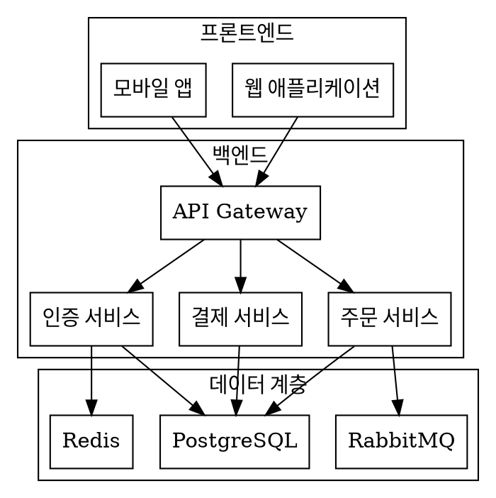
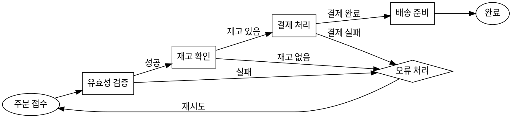

# Graphviz 다이어그램 테스트 문서

| 항목 | 내용 |
|------|------|
| 프로젝트 | 다이어그램 렌더링 테스트 |
| 버전 | v1.0 |
| 작성일 | 2026-02-20 |
| 작성자 | 개발팀 |

---

## 변경 이력

| 버전 | 날짜 | 작성자 | 변경 내용 |
|------|------|--------|-----------|
| v1.0 | 2026-02-20 | 개발팀 | 초기 작성 |

## 1. 시스템 아키텍처

본 문서는 Graphviz DOT 언어로 작성된 다이어그램의 자동 렌더링을 테스트한다.

### 1.1 전체 시스템 구조

<!-- diagram: 전체 시스템 아키텍처 -->

### 1.2 서비스 간 통신

각 서비스는 API Gateway를 통해 라우팅되며, 비동기 처리가 필요한 경우 RabbitMQ를 활용한다.

## 2. 데이터 흐름

### 2.1 주문 처리 플로우

<!-- diagram: 주문 처리 흐름도 -->

### 2.2 데이터 모델

주문 데이터는 PostgreSQL에 저장되며, 결제 상태는 Redis로 캐싱한다.

| 항목 | 규격 |
|------|------|
| 주문 테이블 | orders |
| 결제 테이블 | payments |
| 배송 테이블 | shipments |

## 3. 결론

Graphviz DOT 언어를 활용하여 시스템 아키텍처와 데이터 흐름을 시각화하였다.
